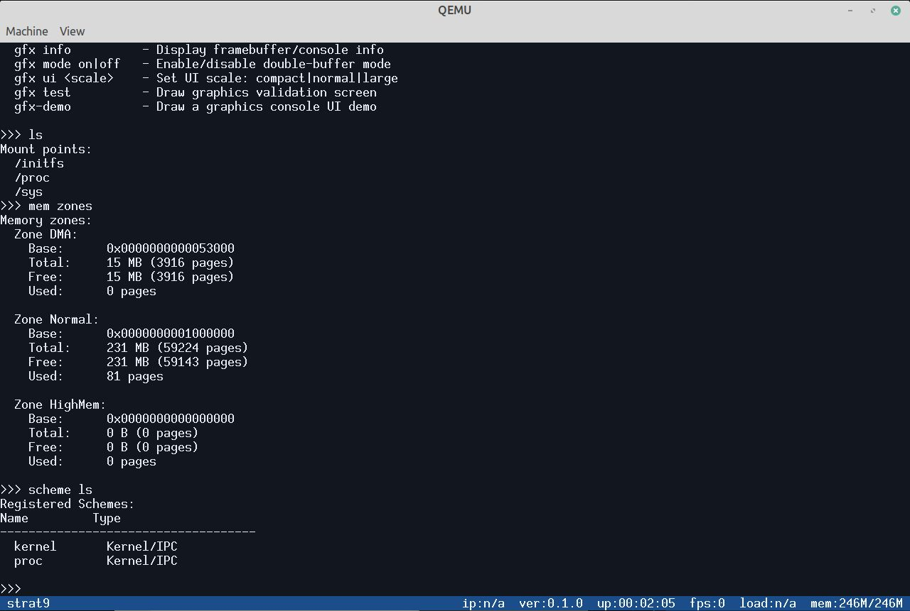
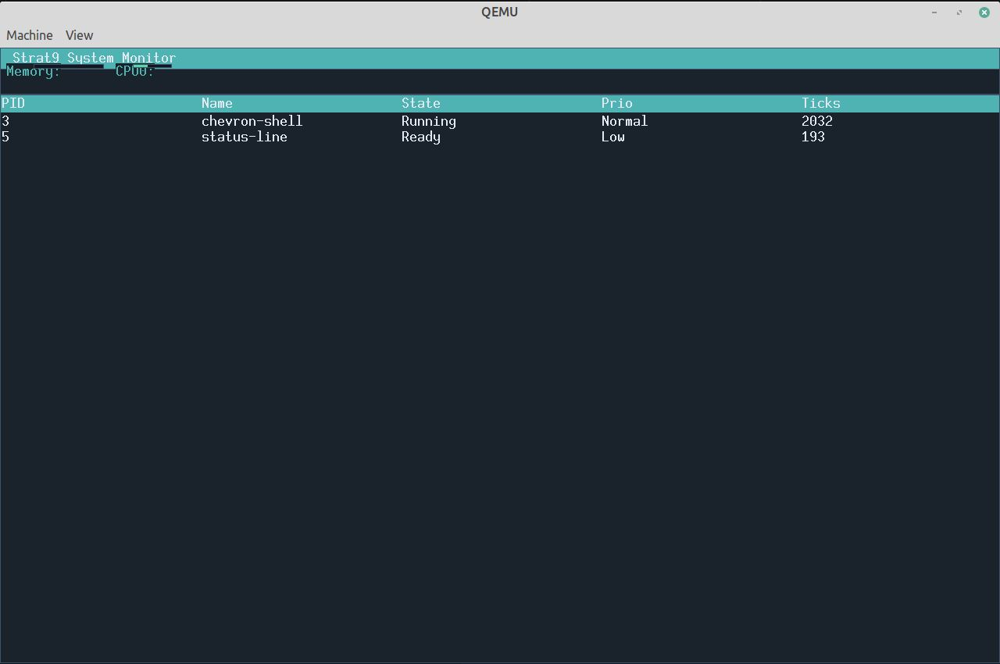
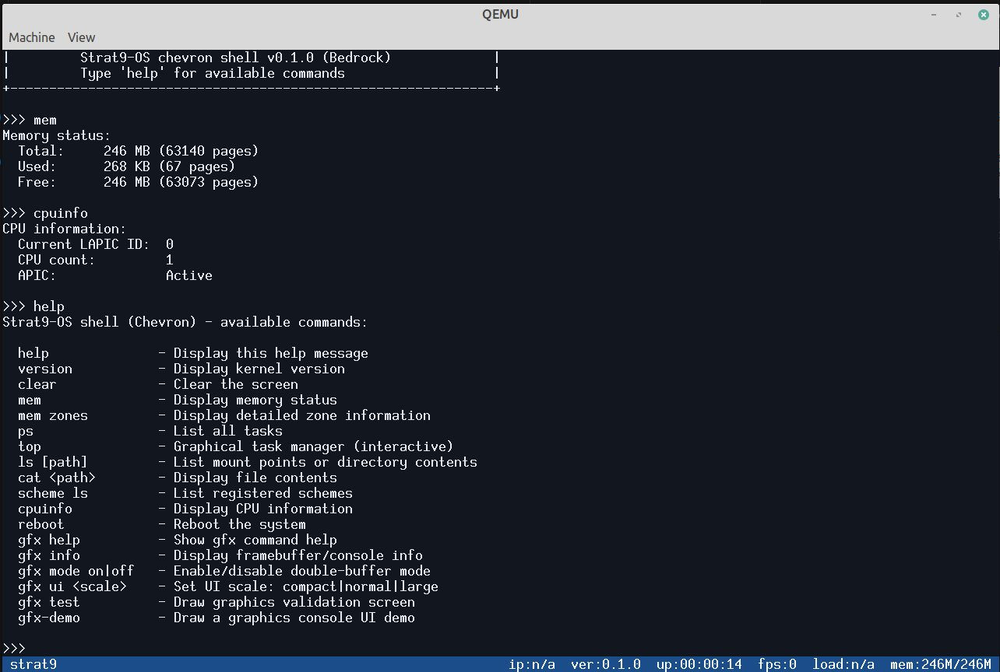
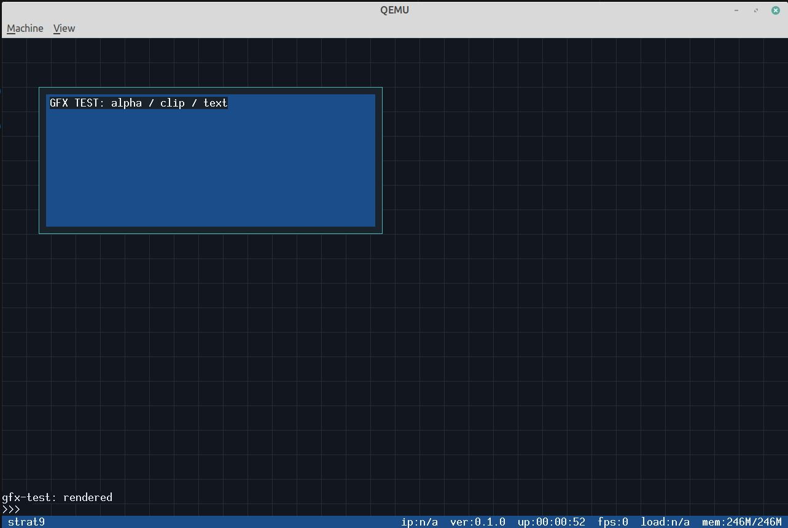
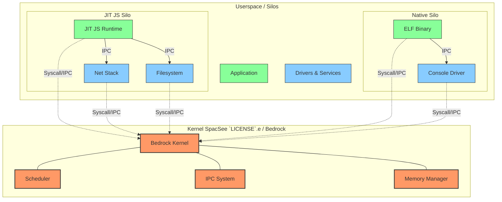

# Strat9-OS

Strat9-OS is a modular microkernel written in Rust and assembly. The kernel provides scheduling, IPC, memory primitives, and interrupt routing. Everything else (filesystems, networking, drivers) runs as isolated userspace components called Silos, also written in Rust. The goal is to run various native binaries (ELF, JS, WASM..) into the kernel.

The goal is to run silos (a kind of containers with ELF/WASM etc) directly on the kernel.

## Architecture

- Kernel (Bedrock) in Ring 0 : minimal, `#![no_std]`.
- Silos are in Ring 3 : isolated components communicate via IPC.
- Capabilities gate access to resources.
- Plan 9 style scheme model for resources.

## Status, some highlights

This project is in active development and not production-ready.

### Screenshots


*Scheme-style filesystem paths*


*Process monitor (top command)*


*Memory and CPU information*


*Graphics subsystem test*

Kernel :

- SMP boot with per-CPU data, TSS/GDT, GSBase SYSCALL, and per-CPU scheduler.
- Preemptive multitasking with APIC timer
- Limine boot path and bootable ISO
- IPC ports, capability manager, and VFS scheme router
- ELF loader and Ring 3 execution
- POSIX interval timers + signal infrastructure

Userspace components :

- EXT4 filesystem component (userspace server)
- XFS filesystem component (userspace server)
- VirtIO block and net drivers (kernel-side)
- libc (relibc from the Redox-OS project)



## Build

### Prerequisites

- Rust nightly with `rust-src` and `llvm-tools-preview`.
- QEMU.

### Commands

#### Install the Rust toolchain

```bash
rustup install nightly
rustup component add rust-src llvm-tools-preview
rustup target add x86_64-unknown-none
```

#### Compile the kernel and run it

```bash
cargo make kernel
cargo make limine-image
cargo make run
```

or

```bash
cargo make run-gui
```

## Repository way of life

- `workspace/kernel/` : the strat9-os kernel : Bedrock
- `workspace/components/` : userspace components
- `workspace/bootloader/` : limine-based bootloader
- `doc/` : specifications and design docs
- `tools/` : build and helper scripts

## License

All the code is under GPLv3. See THIRD_PARTY_LICENCES.txt for more informations about librairies and software shared. Many thanks to the authors !
