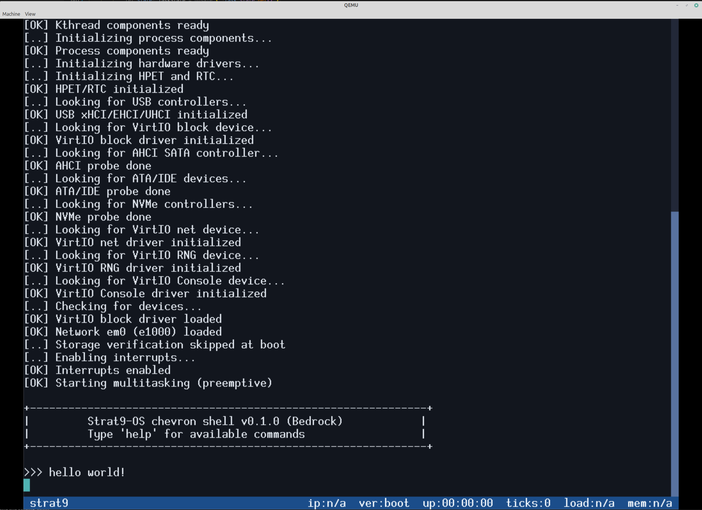
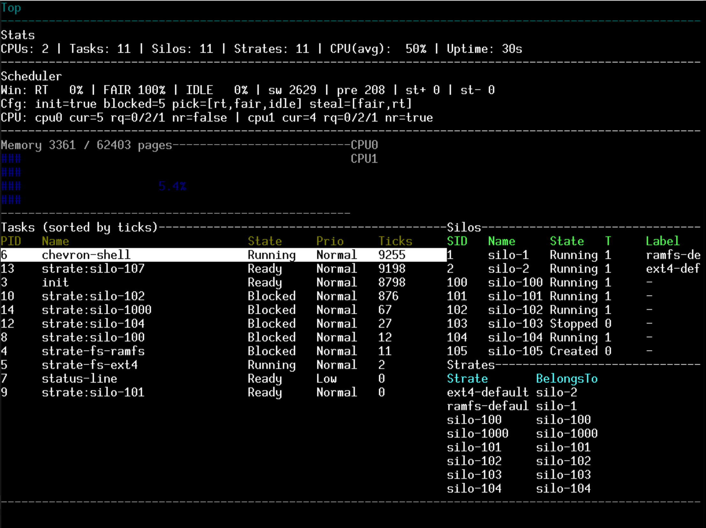
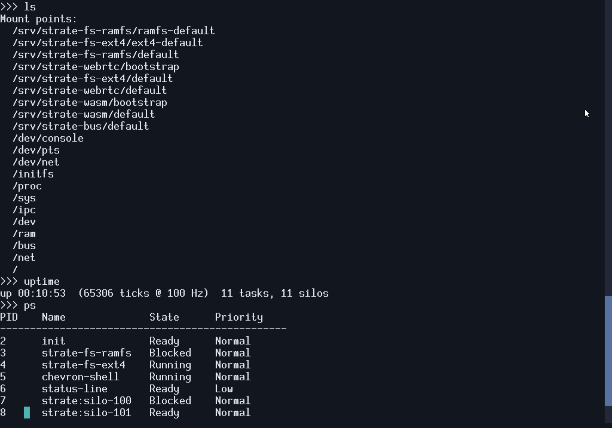
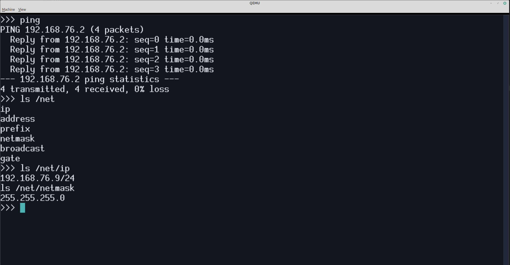
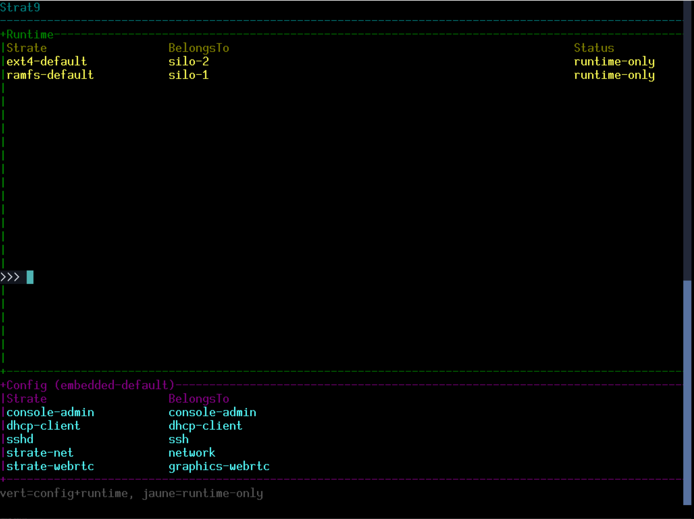
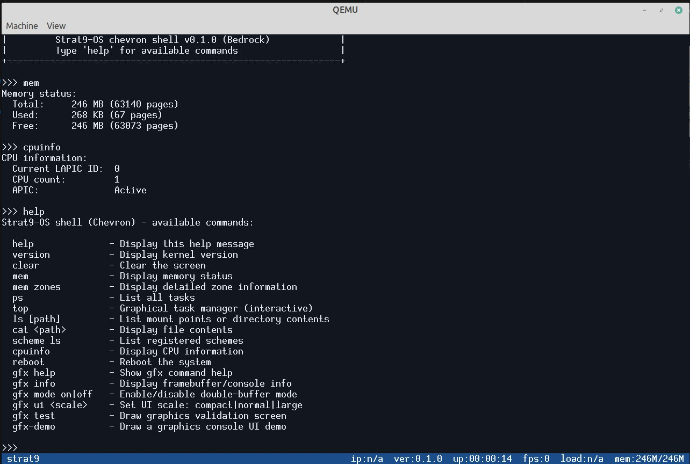
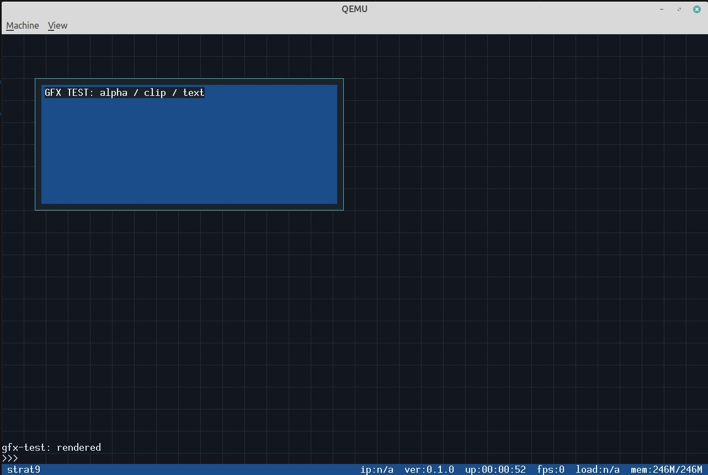
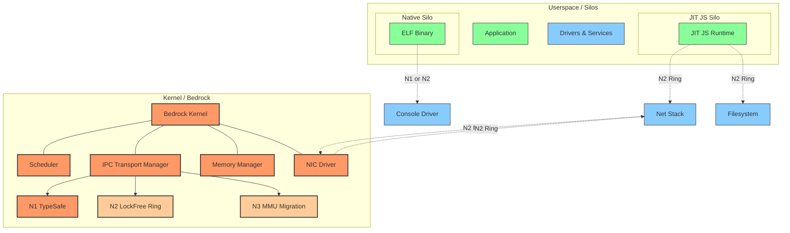

# Strat9-OS

Strat9-OS is an Operating System based on a modular microkernel written in Rust. The kernel provides scheduling, IPC, memory primitives, and interrupt routing. Everything else (filesystems, networking, drivers...) runs as isolated userspace components called Silos, also written in Rust.

The goal is to run various native binaries (ELF, JS, WASM..) inside the silo environment => IPC => kernel. And give features to silos like network stack, filesystem, etc. with Strates.

The Chevron shell can manage silos and strates with a bunch of commands.

Architecture concept summary: Bedrock is the microkernel, Silos are isolated Ring-3 execution units, Strates are functional layers hosted inside Silos and they can discuss together. Silos are isolated eachother.

## Architecture

- Kernel (Bedrock) in Ring 0 : minimal, `#![no_std]`.
- Silos are in Ring 3 : isolated components communicate via IPC.
- **IPC Transport Manager** : 3-level hybrid isolation model (TypeSafe / LockFree / MMU)
- Strate are in Silo : network stack, filesystem, etc.
- Capabilities gate access to resources.
- Plan 9 style scheme model for resources.

## Status, some highlights

This project is in active development and not production-ready. The ABI is still not stabilized. The documentation can be built and published using the `publish-doc.sh` script.

### Screenshots from QEMU : bootsequence and Chevron shell


*Chevron and boot*


*2D framebuffered process monitor like (top command)*


*ls and uptime*


*Networking*


*strate screen management*


*Memory and CPU information*


*Graphics subsystem test*

#### Kernel

    - SMP boot with per-CPU data, TSS/GDT, GSBase-based SYSCALL, per-CPU caches and per-CPU scheduler
    - Two-stage allocator: a pre-buddy boot allocator for early init, then a buddy frame allocator (zones DMA/Normal/HighMem, migratetypes, per-CPU caches) under a slab kernel heap with a vmalloc large-object backend. COW via PTE bit 9 and capability refcounting
    - Virtual memory: 4-level paging, HHDM, CR3 switching, page-fault handling (COW, mmap), user/kernel mappings
    - Preemptive multitasking with APIC/x2APIC and per-CPU timers
    - UEFI boot path and bootable ISO
    - Scheduler with priority/round-robin and CPU hotplug support
    - IPC: 3-level transport manager (TypeSafe / LockFree ring / MMU), synchronous ports, capability manager, VFS scheme router
    - ELF loader and Ring-3 execution (userspace silos)
    - POSIX interval timers and signal infrastructure
    - Interrupts & exceptions: IDT, IRQ handling, exception dumps and backtraces
    - Device model: PCI discovery, VirtIO and legacy drivers (block, net), console drivers
    - Debugging & tooling: early serial/VGA output, configurable log levels, QEMU run targets and ISO tooling
    - ACPI support and power management
    - Optional Linux ABI compatibility shim for ELF binaries

#### Userspace components

    - EXT4 filesystem
    - RamFS filesystem
    - XFS filesystem (WiP and disabled) 
    - VirtIO block and net drivers (kernel-side)
    - libc (musl : statically linked, Linux ABI compatibility)
    - IPv4 network stack with UDP/TCP/ICMP support, dhcp client, telnet server
    - e1000/e1000e and virtio NIC drivers
    - WASM native execution strate
    - CLI for managing silo and strate : memory management, start, stop, delete...
    - Basic commands : cat, ls, uptime, reboot, shutdown, cd, top
    - VFS with /proc /sys ...


```mermaid
graph TD
    subgraph Ring 3 [Userspace / Silos]
        direction TB
        App[Application]:::app
        Drivers[Drivers & Services]:::sys

        subgraph Silo_JS [JIT JS Silo]
            JS_Runtime[JIT JS Runtime]:::app
        end

        subgraph Silo_Native [Native Silo]
            ELF[ELF Binary]:::app
        end
    end

    subgraph Ring 0 [Kernel / Bedrock]
        Kernel[Bedrock Kernel]:::kernel
        Sched[Scheduler]:::kernel
        IPC_MGR[IPC Transport Manager]:::kernel
        N1[N1 TypeSafe]:::kernel
        N2[N2 LockFree Ring]:::transport
        N3[N3 MMU Migration]:::transport
        MM[Memory Manager]:::kernel
        NIC[NIC Driver]:::kernel

        Kernel --- Sched
        Kernel --- IPC_MGR
        IPC_MGR --> N1
        IPC_MGR --> N2
        IPC_MGR --> N3
        Kernel --- MM
        Kernel --- NIC
    end

    JS_Runtime -.->|N2 Ring| Net[Net Stack]:::sys
    JS_Runtime -.->|N2 Ring| FS[Filesystem]:::sys
    ELF -.->|N1 or N2| Console[Console Driver]:::sys
    Net -.->|N2 Ring| NIC
    NIC -.->|N2 Ring| Net

    classDef kernel fill:#f96,stroke:#333,stroke-width:2px;
    classDef transport fill:#fc9,stroke:#333,stroke-width:2px;
    classDef sys fill:#8cf,stroke:#333,stroke-width:1px;
    classDef app fill:#8f9,stroke:#333,stroke-width:1px;
```

## Build

### Prerequisites

- Rust nightly with `rust-src`, `rustc-dev` and `llvm-tools` (see `rust-toolchain.toml`).
  The version is **pinned** in [`rust-toolchain.toml`](rust-toolchain.toml)
  (currently `nightly-2026-07-20`) : newer nightlies break the kernel build
  (the `x86_64` crate no longer compiles against the `Step` trait, and LLVM
  rejects this target's `sse` feature toggling). `cargo` picks the pinned
  toolchain up automatically through rustup; do not replace the pin with
  the floating `nightly` channel.
- QEMU.

### Commands

#### Install the Rust toolchain

```bash
# Installs exactly the pinned version from rust-toolchain.toml:
rustup toolchain install
cargo --version   # run once inside the repo so rustup activates it
rustup component add rust-src rustc-dev llvm-tools   # matches rust-toolchain.toml [components]
rustup target add x86_64-unknown-none x86_64-unknown-uefi
```

#### Compile the kernel and run it

**UEFI (recommended):**
```bash
cargo make bootloader-uefi    # Build UEFI bootloader
cargo make uefi-image         # Create bootable image
cargo make run-uefi           # Run with OVMF
```


## Hardware support

See [HARDWARE.md](HARDWARE.md) for a complete list of supported drivers, tested platforms, and future hardware targets.

### Currently booting on

- QEMU
- VMware Workstation
- Lenovo ThinkPad X13

## Repository way of life

- `workspace/kernel/` : the strat9-os kernel : Bedrock
- `workspace/kernel/libs/` : in-kernel support crates (`component`, `component-macro`)
- `workspace/components/` : userspace components
- `workspace/drivers/` : bus drivers (`strat9-bus-drivers`) and NIC crates (`e1000`, `intel-ethernet`, `nic-queues`, `nic-buffers`, `net-core`, `driver-net-proto`)
- `workspace/bootloader/` : UEFI bootloader (primary) + a **legacy** NASM BIOS bootloader at `workspace/bootloader/asm/x86_64/`, which is not built by any active task and is described as broken in its own Makefile
- `workspace/abi/` : shared ABI definitions (`KernelArgs` boot ABI **v4**, 132 bytes, magic `ST9B`)
- `workspace/kernel-l2-tests/` : host-side test harness that compiles real kernel modules verbatim
- `docs-site/` : the published documentation site (mdBook) sources
- `docs/` : design documents
- `doc/` : specifications, engineering logs and screenshots
- `sdk/` : vendored third-party SDK trees (musl) and the relibc shim
- `tools/` : build and helper scripts

### Related specifications

| Document | Contents | Status |
|----------|----------|--------|
| [docs-site/src/syscalls.md](docs-site/src/syscalls.md) | Full syscall reference with kernel argument lists and the ABI-versus-kernel gap list | Maintained |
| [docs-site/src/abi.md](docs-site/src/abi.md) | `strat9-abi` module map and versioning policy | Maintained |
| [docs-site/src/boot-sequence.md](docs-site/src/boot-sequence.md) | OVMF → UEFI bootloader → kernel chain and the `KernelArgs` handoff | Maintained |
| [docs-site/src/memory-model.md](docs-site/src/memory-model.md) | Buddy, slab, vmalloc, COW, page tables | Maintained |
| [docs-site/src/ipc-mechanisms.md](docs-site/src/ipc-mechanisms.md) | Transport manager, legacy IPC mechanisms | Maintained |
| [docs-site/src/silo.md](docs-site/src/silo.md) | Silo lifecycle, octal mode, pledge/unveil | Maintained |
| [docs-site/src/driver-model.md](docs-site/src/driver-model.md) | Component registration, PCI, driver inventory | Maintained |
| [docs-site/src/abi-matrix.md](docs-site/src/abi-matrix.md) | POSIX API coverage through `musl-compat` | Maintained |
| [doc/silo_security_model.md](doc/silo_security_model.md) | Security model proposal | **Design spec** — IPC coloration, capability derivation, family profiles and the audit ring are **not implemented** |
| [doc/NATIVE_SYSCALLS.md](doc/NATIVE_SYSCALLS.md) | Native syscall reference | **Superseded** by `docs-site/src/syscalls.md` |
| [doc/2026-04-buddy-allocator-evolution.md](doc/2026-04-buddy-allocator-evolution.md) | Buddy allocator engineering log | Dated log, still accurate |
| [doc/riscv-port-implementation.md](doc/riscv-port-implementation.md) | riscv64 port plan | Proposal v1, partially delivered |
| [docs/ipc-transport-manager-design.md](docs/ipc-transport-manager-design.md) | Transport manager design | **Superseded** by the docs-site IPC pages |
| [docs/ipc-n3-mmu-thread-migration-spec.md](docs/ipc-n3-mmu-thread-migration-spec.md) | N3 MMU migration spec | Normative; implementation has known deviations |
| [docs/mr-u-boot-replacement.md](docs/mr-u-boot-replacement.md) | Limine → UEFI bootloader migration | Historical MR summary |

## License

All the code is under GPLv3. See THIRD_PARTY_LICENCES.txt for more informations about librairies and software shared. Many thanks to the authors !
