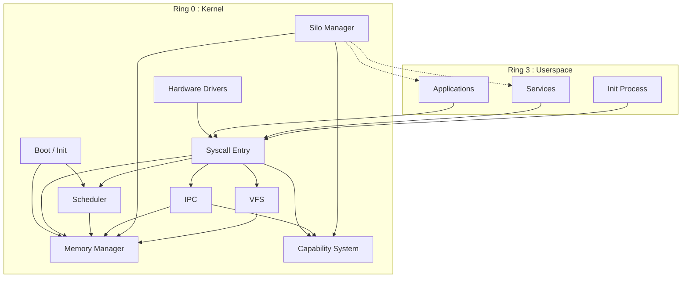
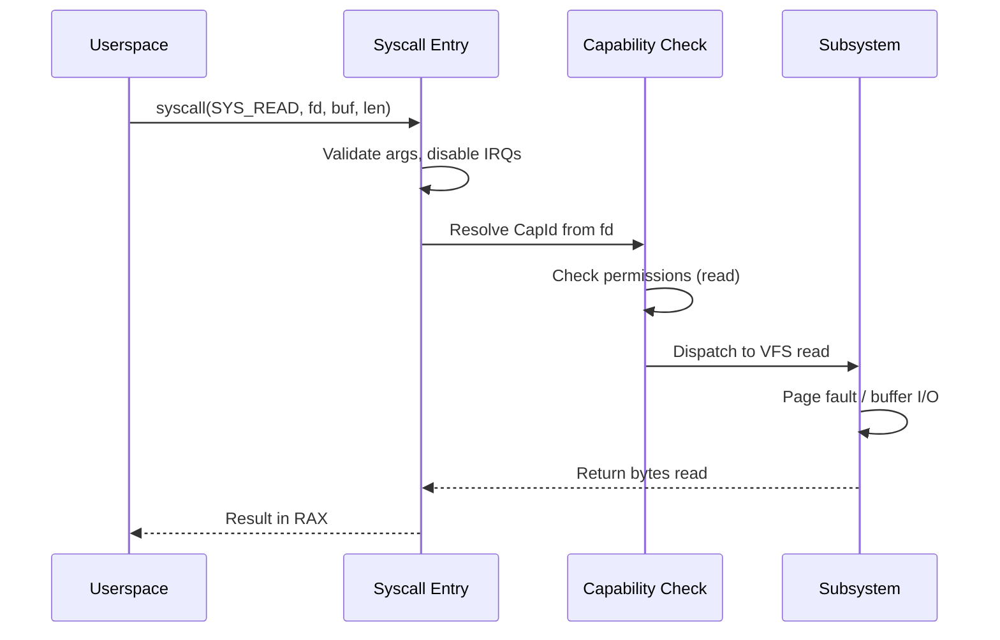

# Architecture Overview

Strat9 OS is a microkernel-inspired operating system written in Rust. The kernel runs in Ring 0 on x86_64, with userspace processes isolated through capability-based security and silo boundaries.

---

## Kernel subsystems

---

## Subsystem summary

| Subsystem | Module | Purpose |
|-----------|--------|---------|
| **Boot** | `boot/` | Assembly stubs (16→64 bit), Limine handoff, early init |
| **Scheduler** | `process/scheduler/` | Per-CPU run queues, multi-class scheduling (RT FIFO/RR, Normal, Idle) |
| **Memory** | `memory/` | Buddy allocator, slab heap, COW, page tables, vmalloc |
| **IPC** | `ipc/` | 3-level Transport Manager (TypeSafe/LockFree/MMU), typed channels, shared rings, semaphores |
| **Capability** | `capability.rs` | Unforgeable tokens, per-resource refcounting |
| **Silo** | `silo/` | Process isolation containers with resource quotas |
| **VFS** | `vfs/` | Virtual filesystem with scheme-based I/O |
| **Syscall** | `syscall/` | Syscall dispatch and validation |
| **Drivers** | `hardware/` | NIC, storage, USB, GPU, VirtIO, PCI |

---

## Design principles

1. **Capability-based security** : All kernel resources (memory, IPC ports, devices) are accessed through unforgeable `CapId` tokens. No raw pointers leak to userspace.

2. **Silo isolation** : Processes run inside *silos* (analogous to containers). Each silo has memory quotas, capability boundaries, and IPC restrictions. Policy lives in userspace; the kernel enforces mechanisms.

3. **Per-CPU scheduling** : Each CPU core has its own run queue set. Tasks are pinned to cores via the scheduler, avoiding cross-core lock contention on the hot path.

4. **COW-first memory** : `fork()` shares pages via copy-on-write. Physical frames are freed only when the last reference disappears. Buddy allocator provides O(1) order-0 allocations via per-CPU caches.

5. **Scheme-based I/O** : Filesystem operations go through a VFS layer that routes to scheme handlers (like Plan 9). Userspace can implement custom schemes for devices, networks, and IPC.

---

## Data flow: userspace syscall

