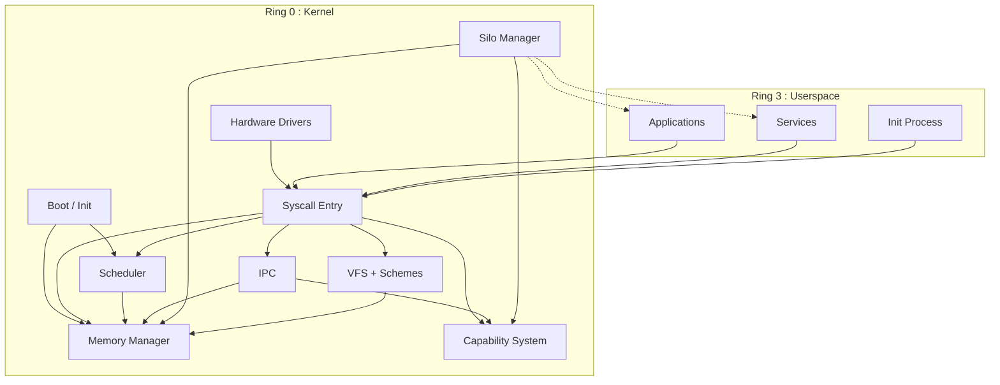
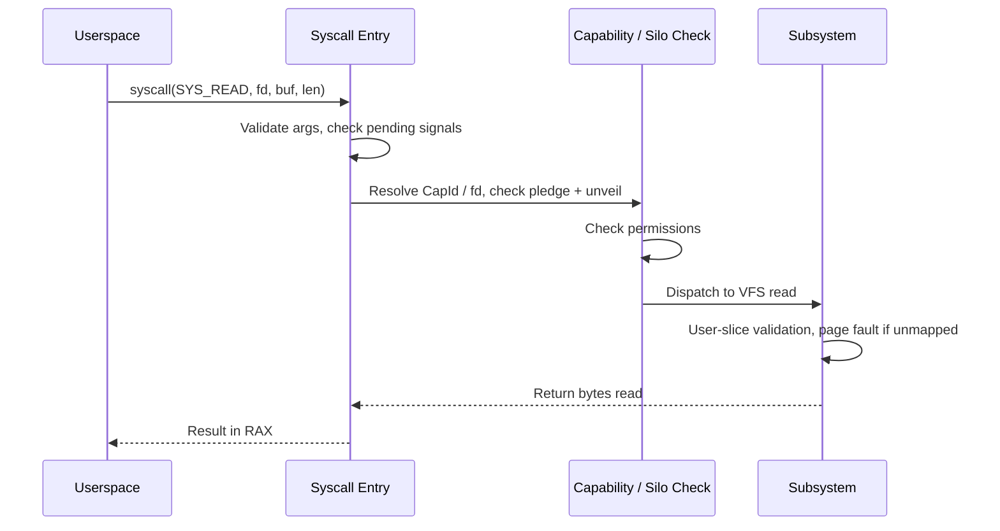

# Architecture Overview

Strat9 OS is a microkernel-inspired operating system written in Rust. The kernel runs in Ring 0 on **x86_64**, booted through a homemade UEFI application. Userspace processes are isolated through capability-based security, four-level page tables with copy-on-write, and silo boundaries.

> **Scope.** Only x86_64 is buildable and bootable today. The riscv64 backend (`kernel/src/arch/riscv64/`) is a two-file stub that is never compiled, and `kernel/src/hal/` is decorative: `X86_64Hal::current_cpu_id()` returns a hard-coded `0` and its text-boundary methods return a constant. The real architecture-neutral layer is `kernel/src/arch/facade.rs`.

---

## Kernel subsystems

```mermaid
graph TB
    subgraph "Ring 0 : Kernel"
        BOOT[Boot / Init]
        SCHED[Scheduler]
        MEM[Memory Manager]
        IPC[IPC]
        CAP[Capability System]
        SILO[Silo Manager]
        VFS[VFS + Schemes]
        SYSCALL[Syscall Entry]
        HW[Hardware Drivers]
    end

    subgraph "Ring 3 : Userspace"
        INIT[Init Process]
        APP[Applications]
        SVC[Services]
    end

    BOOT --> SCHED
    BOOT --> MEM
    SYSCALL --> SCHED
    SYSCALL --> MEM
    SYSCALL --> IPC
    SYSCALL --> CAP
    SYSCALL --> VFS
    SCHED --> MEM
    IPC --> MEM
    IPC --> CAP
    SILO --> CAP
    SILO --> MEM
    VFS --> MEM
    HW --> SYSCALL

    APP --> SYSCALL
    SVC --> SYSCALL
    INIT --> SYSCALL
    SILO -.-> APP
    SILO -.-> SVC
```

---

## Subsystem summary

| Subsystem | Module | Purpose |
|-----------|--------|---------|
| **Boot** | `boot/` | `boot64.S` entry, `KernelArgs` handoff, module validation, logger, panic hooks, symbol table |
| **Scheduler** | `process/scheduler/`, `process/sched_classes/` | Per-CPU run queues, multi-class scheduling, task tables |
| **Process** | `process/` | Tasks, threads, signals, timers, ELF loading, fork/COW |
| **Memory** | `memory/` | Boot allocator, buddy, frame metadata, slab heap, vmalloc, page tables, COW, address spaces, user slices |
| **IPC** | `ipc/`, `async_io/` | Transport manager (TypeSafe/LockFree/MMU), ports, channels, shared rings, semaphores, io_uring-style async rings |
| **Capability** | `capability.rs` | Unforgeable `CapId` tokens with per-resource permissions and refcounting |
| **Silo** | `silo/` | Isolation containers, `OctalMode` pledge/unveil, quotas, module attach, events |
| **VFS** | `vfs/` | Virtual filesystem with Plan 9-style scheme routing |
| **Syscall** | `syscall/` | Dispatch table plus per-domain handlers |
| **Drivers** | `hardware/`, `framebuffer/`, `drivers/` | NIC, storage (virtio-blk, AHCI, NVMe), USB (UHCI/EHCI/xHCI/HID), GPU, PCI, ACPI |
| **ACPI** | `acpi/` | MADT, MCFG, FADT, HPET, RSDT, IVRS, DMAR, SLIT, WAET, BGRT |
| **Kernel shell** | `shell/` | Interactive kernel-mode shell, commands, mouse, scripting |

Several modules declared under `boot/` are **dead code**: `boot.S` (Multiboot1), `fat32_loader.rs`, `virtio_blk.rs`, `block_device.rs` and `fdt.rs` have no call sites. Modules are loaded by the UEFI bootloader from the ESP and registered in the VFS as `/initfs/<name>`.

---

## Design principles

1. **Capability-based security.** Kernel resources (memory regions, IPC ports, volumes, transports) are reached through unforgeable `CapId` handles carrying a permission set (read / write / execute / grant / revoke). The IPC layer injects a capability *badge* into outgoing messages instead of a raw task id, so a receiver learns the sender's authority, not its pid. Raw pointers never cross into userspace.

2. **Silo isolation.** Processes run inside silos, each with an `OctalMode` capability mask, unveil rules for filesystem paths, memory and IPC quotas, and a lifecycle (created / started / suspended / stopped / sandboxed). Policy lives in userspace; the kernel enforces the mechanism. See [Silo System](./silo.md).

3. **Per-CPU scheduling.** Each core has its own run queue set and per-CPU allocator caches, and tasks are pinned to cores, keeping the hot path free of cross-core contention. Frame allocation uses a per-CPU cache of 256 frames per (zone, migratetype) pair with cross-CPU stealing.

4. **Copy-on-write memory.** `fork()` clones page tables, marks writable pages with PTE bit 9, and shares physical frames under capability refcounting. A write fault triggers `handle_cow_fault`, which either upgrades a singly-referenced page in place or allocates and copies. See [Memory Management](./memory-model.md).

5. **Scheme-based I/O.** Filesystem operations go through a VFS layer that routes to scheme handlers, Plan 9 style. Userspace implements custom schemes for devices, networks and IPC, and the current userspace network stack is reached through a `/dev/net` raw-packet scheme rather than BSD sockets.

6. **Plan 9 style user servers.** The kernel exposes no socket API at all. Networking, display and input are ordinary userspace services talking to the kernel over syscalls and schemes.

---

## Data flow: userspace syscall

```mermaid
sequenceDiagram
    participant U as Userspace
    participant K as Syscall Entry
    participant C as Capability / Silo Check
    participant S as Subsystem

    U->>K: syscall(SYS_READ, fd, buf, len)
    K->>K: Validate args, check pending signals
    K->>C: Resolve CapId / fd, check pledge + unveil
    C->>C: Check permissions
    C->>S: Dispatch to VFS read
    S->>S: User-slice validation, page fault if unmapped
    S-->>K: Return bytes read
    K-->>U: Result in RAX
```

Argument validation goes through `UserSliceRead` / `UserSliceWrite`, which check that the userspace range lies below `USER_SPACE_END` and is at most 16 MiB. Single-byte copies are exempt from the size cap. Pending signals are checked on every syscall return through a per-CPU fast flag set by `send_signal`, so a signal targeting the running task costs one atomic test-and-clear on the common path.

See [Syscall Reference](./syscalls.md) for the full table and for the known gaps between the ABI headers and the dispatcher.
