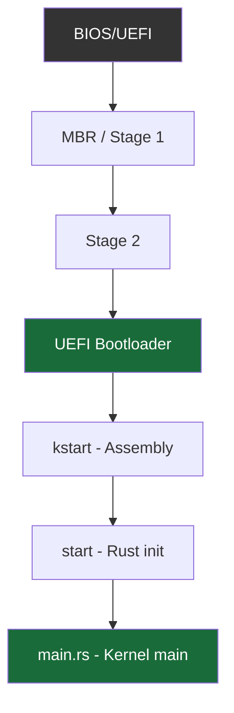
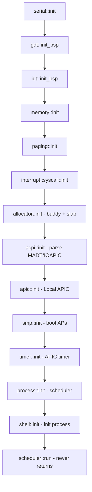
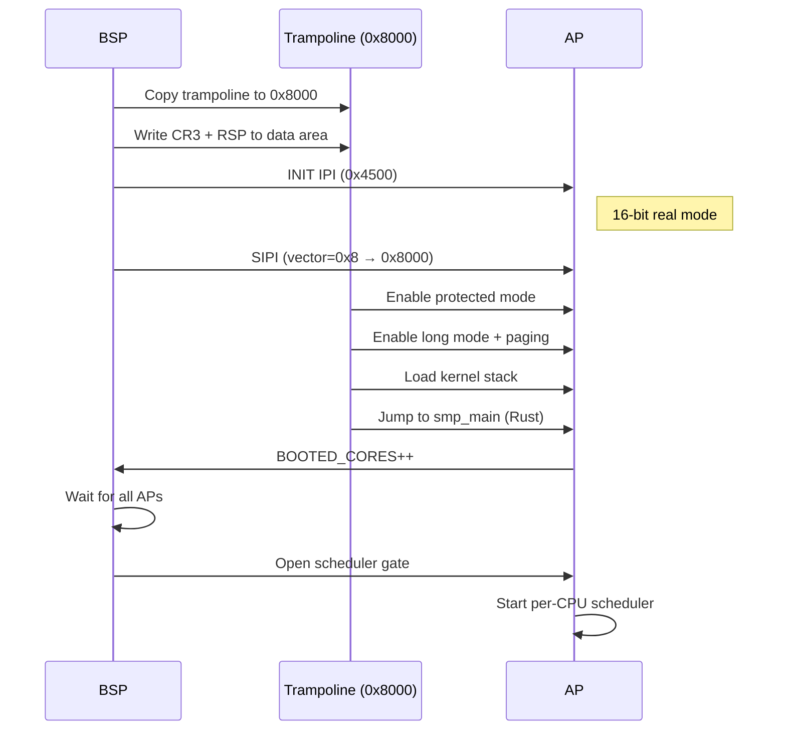

# Boot Sequence

Strat9 OS boots on x86_64 via the UEFI bootloader. The boot flow transitions from 16-bit real mode through protected mode to 64-bit long mode before jumping into Rust.

---

## Boot flow



---

## Stage 1 : MBR bootloader (`bootloader/asm/`)

The bootloader is written in NASM assembly. Stage 1 fits in exactly 512 bytes (MBR).

**Responsibilities:**

1. Load Stage 2 from disk (LBA reads via BIOS INT 13h)
2. Enable A20 line
3. Enter protected mode (32-bit)
4. Jump to Stage 2

---

## Stage 2 : Protected → Long mode

**Responsibilities:**

1. Detect available memory (INT 15h, E820)
2. Load the kernel binary from disk
3. Set up initial page tables (identity mapping + higher-half)
4. Enable PAE, PGE, long mode
5. Jump to 64-bit code

---

## UEFI bootloader handoff

The kernel is loaded by the UEFI bootloader. The bootloader provides:

- Memory map (E820 equivalent)
- HHDM (Higher Half Direct Map) base address
- PML4 physical address
- RSDP (ACPI tables)
- Framebuffer info

The `KernelArgs` struct captures all handoff data:

```text
KernelArgs {
    hhdm_offset: u64,       // Higher-half direct map base
    pml4_physical: u64,     // Boot page table
    acpi_rsdp: Option<NonNull<u8>>,  // ACPI RSDP
    memory_regions: &[MemoryRegion],  // E820 memory map
    framebuffer: FramebufferInfo,     // VGA/framebuffer
}
```

---

## Kernel entry : `kstart` (assembly)

Located in `boot/boot64.S`:

1. Verify BSS is zero, data is non-zero (sanity check)
2. Set up kernel stack (128 KiB, from `STACK` static)
3. Jump to `start()` (Rust)

---

## Kernel init : `start()` (Rust)

Located in `boot/boot.rs` → `main.rs`:



**Key init steps:**

| Step | Module | What happens |
|------|--------|-------------|
| Serial | `serial.rs` | Initialize COM1 (0x3F8) at 115200 baud |
| GDT | `gdt.rs` | Set up kernel/user code/data segments |
| IDT | `idt.rs` | Install interrupt handlers (timer, syscall, page fault) |
| Memory | `memory/` | Parse E820, initialize buddy allocator |
| Paging | `paging.rs` | Set up kernel page tables (HHDM + higher-half) |
| Syscall | `syscall.rs` | Install `syscall`/`sysret` MSRs |
| Heap | `heap.rs` | Initialize slab allocator on top of buddy |
| ACPI | `acpi/` | Parse MADT (APICs), IOAPIC, interrupt overrides |
| APIC | `apic.rs` | Initialize Local APIC (xAPIC or x2APIC) |
| SMP | `smp.rs` | INIT+SIPI sequence to boot Application Processors |
| Timer | `timer.rs` | Calibrate and start APIC timer (periodic) |
| Scheduler | `scheduler/` | Create per-CPU run queues, spawn idle tasks |
| Init | `shell/` | Spawn the first userspace process (init) |

---

## SMP boot : Application Processors


