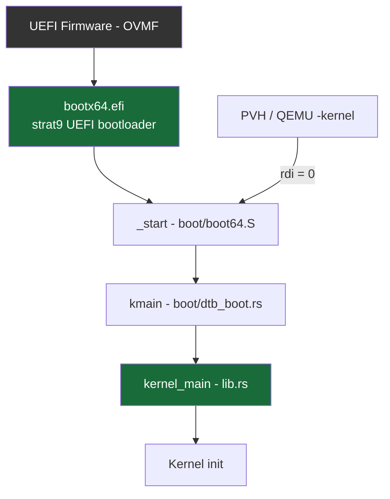
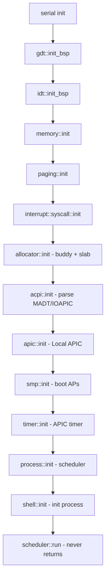
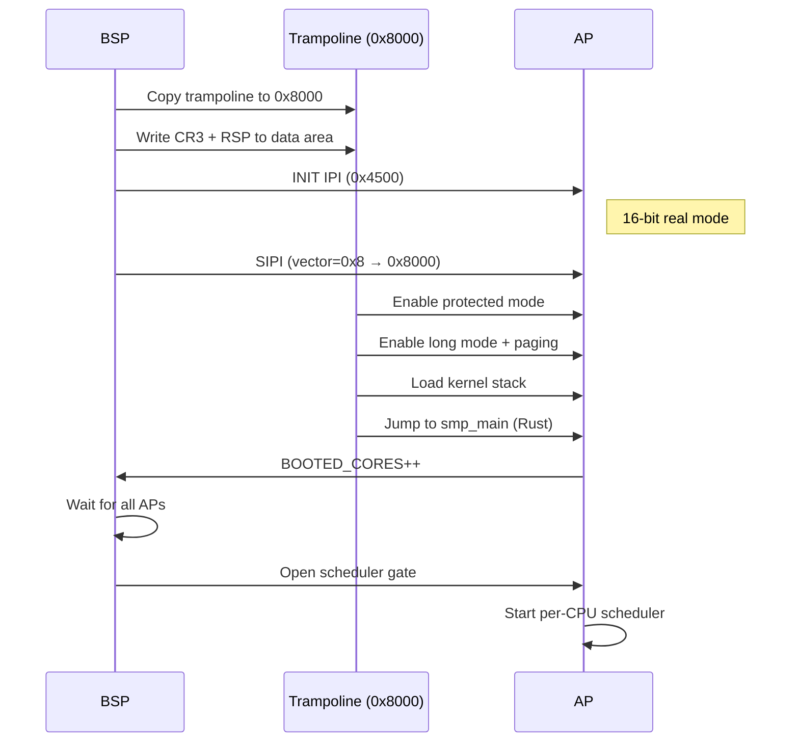

# Boot Sequence

Strat9 OS boots on x86_64 via its own UEFI bootloader (`workspace/bootloader`,
built as `bootx64.efi` for the `x86_64-unknown-uefi` target). Two secondary
paths exist: direct PVH boot (QEMU `-kernel`, no bootloader) and the archived
BIOS assembly stages (legacy, not part of the default build flow).

---

## Boot flow



The handoff contract is the `KernelArgs` structure defined in
`strat9_abi::boot` (`workspace/abi/src/boot.rs`), validated by magic
(`"ST9B"`) and ABI version.

---

## UEFI bootloader (`workspace/bootloader`)

Implemented in Rust on top of the `uefi` crate:

1. Open the ESP (SimpleFileSystem) and read `\boot\kernel.elf`
2. Parse ELF64 and copy `PT_LOAD` segments to their physical addresses
   (higher-half `p_paddr` values are rebased to 1 MiB + offset)
3. Load modules from `/boot/initfs/` (known filenames, up to 64 entries)
4. GOP → pick largest framebuffer mode, record pixel masks
5. ACPI RSDP from the UEFI config table, with a physical-memory scan fallback
6. Build a `key=value` environment string (max 4096 bytes)
7. `ExitBootServices()` → re-init COM1 serial
8. Convert the UEFI memory map into `MemoryRegion`s (Free/Reclaim/Reserved),
   sort and merge them, then carve out the memory map, boot stack (with guard
   page), module table and environment from Free regions so the kernel never
   sees them as available
9. Create page tables: identity map of the first **8 GB** (NX), higher-half
   kernel mapping at `0xFFFFFFFF_8000_0000` (read-only + executable, W^X),
   framebuffer at `0xFFFF_DEAD_0000_0000`, env string at `0xFFFF_BEEF_0000_0000`
10. `context_switch`: load CR3, switch to the boot stack, jump to the kernel
    entry with a pointer to `KernelArgs` in RDI

### Virtual memory layout (BOOTBOOT-inspired)

```text
0xFFFF_DEAD_0000_0000  → Framebuffer
0xFFFF_BEEF_0000_0000  → Environment string
0xFFFFFFFF_8000_0000  → Kernel code/data
0x0000_0000_0000_0000  → Identity map (first 8GB)
```

---

## KernelArgs handoff

Authoritative definition: `workspace/abi/src/boot.rs` (132 bytes,
`#[repr(C, packed)]`). Main fields:

```text
KernelArgs {
    magic: u32,                 // "ST9B"
    abi_version: u32,           // STRAT9_BOOT_ABI_VERSION (currently 4)
    kernel_base: u64,           // physical base of loaded segments
    kernel_size: u64,           // physical span incl. BSS margin
    acpi_rsdp_base: u64,        // RSDP physical address
    memory_map_base/size: u64,  // MemoryRegion array (E820 equivalent)
    framebuffer_addr: u64,      // VIRTUAL address (0xFFFF_DEAD...)
    framebuffer_width/height/stride/bpp + RGB masks,
    hhdm_offset: u64,           // currently always 0 (identity map serves)
    cmdline_ptr/len: u64,       // key=value environment string
    modules_base/size: u64,     // ModuleTable { count, [ModuleEntry; 64] }
    bss_virt_base/size: u64,    // zero-init region description
}
```

Notes:

- There is **no stack field**: the bootloader only provides a temporary
  bootstrap stack; the kernel allocates its own after memory init.
- The PML4 address is **not** passed through the struct: the bootloader loads
  it into CR3 before jumping.
- A null RDI means "no bootloader" (PVH path): the kernel builds a minimal
  `KernelArgs` internally (`build_minimal_args`).

---

## Boot hardening

The loader and the early kernel cooperate on memory safety:

- **Loader input validation** — the ELF parser is bounds-checked with
  arithmetic that cannot wrap; higher-half `p_paddr` values are only rebased
  inside the supported kernel window, and out-of-window or truncated inputs
  are fatal errors (never silently skipped segments).
- **W^X per segment** — the higher-half kernel mapping applies ELF `p_flags`
  per segment: code is execute-only, data/stack writable but non-executable,
  rodata read-only. The 8 GiB identity map is RW+NX and `EFER.NXE` is set
  before CR3 is loaded. The framebuffer mapping uses Write-Combining through
  a dedicated IA32_PAT entry (entry 4, programmed at context switch), so
  full-rate pixel stores do not pollute the caches.
- **Unified present throttling** — one shared `PRESENT_MIN_TICKS` constant
  (16 ticks ≈ 160 ms at TIMER_HZ=100) gates console and driver redraws;
  self-paced paths (compositor damage loop, `swap_buffers`) bypass it.
- **No allocator foot-guns** — every bootloader allocation (memory map, boot
  stack with guard page, module table, env string, `KernelArgs` page) is
  carved out of Free regions before the map is handed over; page-table frames
  are validated against usable RAM. On the kernel side, `kernel_main`
  re-reserves the kernel image, all boot page-table frames (CR3 walk) and
  module data from the working map *before* the boot/buddy allocators run.
- **Bounded allocations & full reads** — kernel/modules sizes are capped,
  file reads loop until complete, truncated images never reach execution.
- **Post-EBS failures halt cleanly** — fatal paths after
  `ExitBootServices()` write to COM1 and halt; UEFI services are never
  called again.

The ESP itself is trusted input in the current alpha stage (no signature
verification); the staged signing plan is documented in
`workspace/bootloader/README.md`.

---

## Archived BIOS stages (`workspace/bootloader/asm/`)

Legacy NASM stage1/stage2 (MBR → protected mode → long mode). Not built by
the default flow anymore and kept for reference only. Historical notes:
A20 was enabled in stage 2, and stage 2 used a hardcoded memory map rather
than an INT 15h/E820 query.

---

## Kernel entry : `_start` (assembly)

Located in `boot/boot64.S` (linked as `ENTRY(_start)`):

1. Save the `KernelArgs` pointer (RDI → R15)
2. Switch to the 64 KiB bootstrap stack (`.boot.stack`)
3. Clear BSS (`__bss_start` → `__bss_end`)
4. Call `kmain(args_ptr)` (Rust)

---

## Kernel init : `kmain()` then `kernel_main()`

- `kmain()` — `boot/dtb_boot.rs`: early raw serial output, enable SSE/OSXSAVE,
  read or synthesize `KernelArgs`, validate the magic, then call
  `crate::kernel_main(&args)`.
- `kernel_main()` — `src/lib.rs`: validates ABI version, reserves bootloader
  ranges (modules, memory map...) from Free/Reclaim regions, initializes the
  buddy allocator, allocates the real kernel stack (256 KiB) and switches to
  it via `switch_stack`, then runs the rest of init.



**Key init steps:**

| Step | Module | What happens |
|------|--------|-------------|
| Serial | `arch/x86_64/serial.rs` | Initialize COM1 (0x3F8) at 115200 baud |
| GDT | `arch/x86_64/gdt.rs` | Set up kernel/user code/data segments |
| IDT | `arch/x86_64/idt.rs` | Install interrupt handlers (timer, syscall, page fault) |
| Memory | `memory/` | Consume the boot memory map, initialize buddy allocator |
| Paging | `memory/paging` | Install kernel page tables (HHDM + higher-half) |
| Syscall | `syscall/` | Install `syscall`/`sysret` MSRs |
| Heap | `memory/` | Initialize slab allocator on top of buddy |
| ACPI | `acpi/` | Parse MADT (APICs), IOAPIC, interrupt overrides |
| APIC | `arch/x86_64/apic.rs` | Initialize Local APIC (xAPIC or x2APIC) |
| SMP | `arch/x86_64/smp.rs` | INIT+SIPI sequence to boot Application Processors |
| Timer | `arch/x86_64/timer.rs` | Calibrate and start APIC timer (periodic) |
| Scheduler | `process/` | Create per-CPU run queues, spawn idle tasks |
| Init | `shell/` | Spawn the first userspace process (init) |

---

## SMP boot : Application Processors


