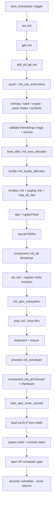

# Boot Sequence

Strat9 OS boots on **x86_64 only**, through a homemade Rust UEFI application. There is no BIOS bootloader, no 16-bit real-mode stage, and no Limine: firmware enters the bootloader already in long mode, the bootloader builds page tables, calls `ExitBootServices`, and switches CR3 straight into the kernel.

> **Architecture support.** x86_64 is the only buildable and bootable target. `rust-toolchain.toml` pins `targets = ["x86_64-unknown-none"]`, `Makefile.toml` hardcodes `KERNEL_TARGET = "x86_64-unknown-none"`, and the bootloader targets `x86_64-unknown-uefi`. A **riscv64** port is in progress as a stub (`kernel/src/arch/riscv64/`, `targets/riscv64-strat9.json`, `doc/riscv-port-implementation.md`) — it is never compiled. There is **no aarch64 port**; the only aarch64 code is two NEON framebuffer files gated behind `#[cfg(target_arch = "aarch64")]`.

---

## Boot flow

```mermaid
flowchart TD
    A[QEMU q35 / OVMF] --> B[ESP: FAT32, GPT]
    B --> C[BOOTX64.EFI<br/>strat9-bootloader.efi]
    C --> D[/boot/kernel.elf]
    C --> E[/boot/initfs/*<br/>must contain init or strate-init]
    D --> F[boot64.S : _start]
    E --> F
    F --> G[kmain]
    G --> H[kernel_main]
    H --> I[process::schedule - never returns]

    style A fill:#333,color:#fff
    style C fill:#1a6b3a,color:#fff
    style I fill:#1a6b3a,color:#fff
```

The image is built by `tools/scripts/create-uefi-image.sh`. The ESP spans sectors 2048..526335 (256 MiB).

---

## Stage : the UEFI bootloader

`workspace/bootloader`, built for `x86_64-unknown-uefi`. Entry point `workspace/bootloader/src/main.rs`; see also `boot_plan.rs`, `cpu.rs`, `elf.rs`, `graphics.rs`, `memory_map.rs`, `memory.rs`, `modules.rs`, `page_tables.rs`, `paging.rs`.

`boot_kernel()` executes in this order:

1. `BootMemory::new()` and a serial banner
2. `cpu::detect()` — CPUID feature detection
3. `LoadedImage` protocol; verify `paging::context_switch` lies inside the loaded image
4. `SimpleFileSystem` protocol; open the ESP volume
5. Read `\boot\kernel.elf` into a `Vec`
6. `elf::parse_elf64`, then `allocate_preferred` + `load_into`
7. `modules::load_modules` from `\boot\initfs` — **a file named `init` or `strate-init` must exist or boot aborts** (`modules.rs:149-157`)
8. `select_framebuffer()` — walks every GOP mode and picks the best. `PixelFormat::Bitmask` and `BltOnly` are **rejected**
9. Locate the ACPI RSDP via `ACPI2_GUID`, falling back to `ACPI_GUID`
10. Build a 4096-byte `key=value\n` environment string
11. Allocate: a 64 KiB transition stack, the module table, the environment block, the `KernelArgs` page, the memory-map array, and a page-table arena
12. Build the boot page tables → `pml4_phys`
13. Pre-flight conversion of the UEFI memory map
14. `uefi::boot::exit_boot_services(Some(LOADER_DATA))`, immediately followed by `cli` / `cld`
15. Re-initialise COM1 (firmware may have left it in an unknown state)
16. Fill `KernelArgs` and write it into a reserved page
17. `paging::context_switch(pml4_phys, stack_top, entry, args_ptr)`

### `context_switch`

`workspace/bootloader/src/paging.rs` is inline assembly that:

- fixes CR0 (clears `EM` and `TS`, sets `MP`, `NE`, `WP`)
- disables caching, executes `wbinvd`
- clears CR4 `PCIDE | PGE`, sets `OSFXSR | OSXMMEXCPT`
- sets `IA32_EFER.NXE`
- sets `rsp`, loads `cr3`, executes `wbinvd`
- re-enables caching and jumps to the kernel entry point

### Virtual address map

Defined in `workspace/bootloader/src/page_tables.rs` and `boot_plan.rs`:

| Symbol | Value | Purpose |
|--------|-------|---------|
| `KERNEL_VIRT_BASE` | `0xFFFF_FFFF_8000_0000` | Higher-half kernel |
| `KERNEL_PHYS_BASE` | `0x10_0000` (1 MiB) | Load address, `MAX_KERNEL_IMAGE_SIZE = 1 GiB` |
| `HHDM_OFFSET` | `0xFFFF_FF00_0000_0000` | Higher-half direct map — **not** the more common `0xFFFF_8000_0000_0000` |
| `FRAMEBUFFER_BASE` | `0xFFFF_DEAD_0000_0000` | Framebuffer window |
| `ENVIRONMENT_BASE` | `0xFFFF_BEEF_0000_0000` | Environment string |
| `INITIAL_ALLOCATION_LIMIT` | 8 GiB | |
| `MAX_DIRECT_MAP` | 512 GiB | |

Paging is 4-level; PML4 slot 0 is the identity map and slot 1 is the HHDM.

### Environment string

Rather than a kernel command line, the bootloader passes a `key=value\n` string (max 4096 bytes), readable via `KernelArgs::env_get()`:

`loader`, `loader.version`, `loader.paging`, `fb.phys`, `fb.virt`, `fb.width`, `fb.height`, `fb.stride`, `fb.bpp`, `acpi.rsdp`, `console=ttyS0`, `console.baud=115200`, `kernel.entry`.

---

## Boot handoff: `KernelArgs`

Defined in [`workspace/abi/src/boot.rs`](https://git.strat9-os.org/strat9-os/strat9-os/blob/main/workspace/abi/src/boot.rs). `#[repr(C, packed)]`, **exactly 132 bytes** (asserted at compile time in two places).

- `STRAT9_BOOT_MAGIC = 0x5354_3942` (`"ST9B"`)
- `STRAT9_BOOT_ABI_VERSION = 4`

```text
offset  field                        type
------  --------------------------  ----
   0    magic                        u32
   4    abi_version                  u32
   8    kernel_base                  u64
  16    kernel_size                  u64
  24    acpi_rsdp_base               u64   physical address
  32    memory_map_base              u64   physical, array of MemoryRegion
  40    memory_map_size              u64
  48    framebuffer_addr             u64   PHYSICAL address of the FB
  56    hhdm_offset                  u64
  64    cmdline_ptr                  u64   physical, key=value string
  72    cmdline_len                  u64
  80    modules_base                 u64   physical, ModuleTable
  88    modules_size                 u64
  96    framebuffer_width            u32
 100    framebuffer_height           u32
 104    framebuffer_stride           u32
 108    framebuffer_bpp              u16
 110    framebuffer_red_mask_size    u8
 111    framebuffer_red_mask_shift   u8
 112    framebuffer_green_mask_size  u8
 113    framebuffer_green_mask_shift u8
 114    framebuffer_blue_mask_size   u8
 115    framebuffer_blue_mask_shift  u8
 116    bss_virt_base                u64
 124    bss_virt_size                u64
```

**Points worth knowing:**

- **There is no PML4 address in `KernelArgs`.** The loader keeps `pml4_phys` for its own `context_switch` and prints it over serial; the kernel recovers CR3 itself. Any documentation showing a `pml4_physical` field is wrong.
- **The memory map is the UEFI map, not E820.** The bootloader calls `uefi::boot::memory_map()` before `exit_boot_services()` and converts it: `CONVENTIONAL` → `MemoryKind::Free`, `BOOT_SERVICES_*` / `LOADER_*` → `Reclaim`, everything else → `Reserved`. There is no INT 13h or INT 15h/E820 in the active path.
- **`framebuffer_addr` is a physical address.** The virtual FB address (`0xFFFF_DEAD_0000_0000`) appears only in the `fb.virt=` environment key. The kernel defensively accepts either form.
- `acpi_rsdp_base` is a plain `u64` physical address, not `Option<NonNull<u8>>`.

### Supporting structures

| Type | Layout | Notes |
|------|--------|-------|
| `MemoryRegion` | `{ base: u64, size: u64, kind: MemoryKind }`, 24 B, align 8 | |
| `MemoryKind` | `#[repr(transparent)] struct MemoryKind(pub u64)` | A newtype, not a Rust `enum`. `Null=0`, `Free=1`, `Reclaim=2`, `Reserved=3` |
| `ModuleTable` | `{ count: u32, entries: [ModuleEntry; 64] }`, 5128 B | `MAX_BOOT_MODULES = 64` |
| `ModuleEntry` | `{ name: [u8; 64], base: u64, size: u64 }`, 80 B | |
| — | `MAX_BOOT_MEMORY_REGIONS = 1024` | |

All accessors validate the advertised extent before dereferencing: `memory_regions()`, `modules()`, `cmdline_bytes()`, `cmdline_str()`, `env_get()`.

---

## Kernel entry : `boot64.S`

`workspace/kernel/src/boot/boot64.S` (ATT syntax, included by `boot/assembly.rs`):

1. `cli` / `cld`, stash the `KernelArgs` pointer from `%rdi` in `%r15`
2. Fill a 256-entry **early IDT** whose every entry points at `early_fault_halt`
3. `lgdt` / `lidt` the early GDT, then `lretq` to reload `CS`
4. Write `'A'` to port `0xE9` (QEMU debug exit) as a progress marker
5. **Clear BSS** from `__bss_start` to `__bss_end` with `rep stosb`
6. Write `'B'`, load `boot_stack_top` into `%rsp` (**64 KiB** static stack), restore `%r15` to `%rdi`, write `'C'`, `call kmain`

The call chain is:

```text
boot64.S:_start
  → kmain              (kernel/src/boot/dtb_boot.rs)
  → crate::kernel_main (kernel/src/lib.rs)
  → process::schedule() — never returns
```

There is **no `kstart` symbol** anywhere in the repository. Interrupts stay disabled through all of `kernel_main`; `sti` happens in `task_entry_trampoline`, not in the init path.

> `boot64.S` also exports `switch_stack`, which is declared in `lib.rs` but **never called**: `kernel_main` allocates a 256 KiB kernel stack, logs it, and prints "stack switch deferred". `stack_switch_entry` is an `hlt` loop.

---

## Kernel init : `kernel_main`

`workspace/kernel/src/lib.rs`. Interrupts remain disabled; `debug_assert!` checkpoints are placed through the sequence.


```mermaid
flowchart TD
    A[boot_timestamp / logger] --> B[tss::init]
    B --> C[gdt::init]
    C --> D[x86_64::idt::init]
    D --> E[cpuid + init_cpu_extensions]
    E --> F[entropy / kaslr / crypto / panic hooks / symbols]
    F --> G[validate KernelArgs magic + version]
    G --> H[boot_alloc::init_boot_allocator]
    H --> I[buddy::init_buddy_allocator]
    I --> J[vmalloc::init + paging::init + map_all_ram]
    J --> K[vga + vgabuf flush]
    K --> L[syscall MSRs]
    L --> M[component::init_all Bootstrap]
    M --> N[vfs::init + register /initfs modules]
    N --> O[init_apic_subsystem]
    O --> P[smp::init - boot APs]
    P --> Q[keyboard + mouse]
    Q --> R[process::init_scheduler]
    R --> S[component::init_all Kthread + Hardware]
    S --> T[start_apic_timer_cached]
    T --> U[load init ELF from /initfs]
    U --> V[spawn shell + console tasks]
    V --> W[open AP scheduler gate]
    W --> X[process::schedule - never returns]
```

### Ordered init steps

| # | Step | Location in `lib.rs` | What happens |
|---|------|----------------------|--------------|
| 1 | Boot timestamp | 356 | `x86_64::boot_timestamp::init()` |
| 2 | Logger | 401-404 | Serial log prefix, then `boot::logger::init()` |
| 3 | **TSS** | 417 | `arch::tss::init()` |
| 4 | **GDT** | 419 | `arch::gdt::init()` |
| 5 | **IDT** | 421 | `arch::x86_64::idt::init()` |
| 6 | CPU features | 453-462 | `cpuid::init()`, FPU/SSE/SMEP/SMAP/XSAVE, `set_extensions_ready()` |
| 7 | Security init | 466-484 | `entropy::seed_from_rdrand`, `kaslr::init`, `crypto::init`, default panic hooks, symbol table |
| 8 | **Boot args validation** | 518-551 | Null check, then magic and ABI-version check |
| 9 | Publish `BOOT_ARGS` | 533 | Stored in a global |
| 10 | HHDM + UEFI reclaim | 575-580 | `set_hhdm_offset`, and `retire_uefi_identity_code()` when `loader.paging=wx-uc-v1` |
| 11 | Parse handoff data | 608-615 | `memory_regions()`, `modules()`, `validate_modules()` |
| 12 | Copy regions | 677 | Into the static `MMAP_WORK[1024]` |
| 13 | **Boot allocator** | 684-692 | `boot_alloc::set_protected_ranges` + `init_boot_allocator` |
| 14 | Frame metadata | 714-733 | `frame::metadata_size_for` + `init_metadata_array` |
| 15 | **Buddy allocator** | 743 | `buddy::init_buddy_allocator(...)` |
| 16 | Kernel stack | 757-801 | Allocates 256 KiB; **switch is deferred** |
| 17 | Kernel config | 811 | `boot::config::apply_kernel_config()` — currently a no-op stub |
| 18 | **Vmalloc** | 814 | `memory::vmalloc::init()` |
| 19 | **Paging** | 841-859 | `paging::init(hhdm)`, `map_all_ram`, identity-map the framebuffer |
| 20 | VGA | 874-888 | `vga::init` + `vgabuf_flush_to_framebuffer()` |
| 21 | **Syscall MSRs** | 903 | `SYSCALL` / `SYSRET` / `STAR` / `LSTAR` / `SFMASK` |
| 22 | Components (bootstrap) | 912 | `component::init_all(InitStage::Bootstrap)` |
| 23 | Kernel address space | 928 | `address_space::init_kernel_address_space()` |
| 24 | **VFS** | 943-947 | `vfs::init()`, then `vfs::register_initfs_file("/initfs/<name>", …)` per boot module |
| 25 | ACPI identity map | 958 | `ensure_identity_map(args.acpi_rsdp_base)` |
| 26 | **APIC subsystem** | 961 | See below |
| 27 | TLB | 980 | `arch::tlb::init()` when the APIC is active |
| 28 | Per-CPU | 993-994 | `percpu::init_boot_cpu(bsp_apic_id)`, `init_gs_base(0)` |
| 29 | **SMP** | 998 | `arch::smp::init()` — boots the APs |
| 30 | Input | 1014-1021 | PS/2 keyboard, then PS/2 mouse when the APIC is active |
| 31 | **Scheduler** | 1039 | `process::init_scheduler()` |
| 32 | **APIC timer** | 1070 | `start_apic_timer_cached()` on the BSP — **the first point at which IF may be enabled** |
| 33 | Components (kthread) | 1087 | `InitStage::Kthread` |
| 34 | Components (hardware) | 1101 | `InitStage::Hardware` |
| 35 | Device enumeration | 1148-1207 | virtio-blk, AHCI, NVMe, NICs |
| 36 | **Load init** | 1215-1295 | `process::elf::load_and_run_elf_with_caps` on `/initfs/init` or `/initfs/strate-init`, with a fallback through the boot-module table |
| 37 | Grant volume capability | 1301 | To the init process |
| 38 | Spawn kernel tasks | 1318-1375 | `shell::shell_main` (64 KiB), then `console-mouse`, `console-render` (`vgabuf::console_task_main`) and `serial-output` (32 KiB) — **x86_64 only** — plus a `status-line` kthread |
| 39 | Keyboard layout | 1383 | `arch::keyboard_layout::set_french_layout()` (FR by default) |
| 40 | Open AP gate | 1390 | `smp::open_ap_scheduler_gate()` |
| 41 | Speaker | 1396 | `arch::speaker::beep_startup()` |
| 42 | **Run** | 1407 | `process::schedule()` — never returns |

### APIC / ACPI bring-up detail

`init_apic_subsystem(rsdp_virt)` (`lib.rs:1414-1584`) performs:

- `apic::is_present()` via CPUID
- `acpi::init(rsdp_vaddr)`
- `acpi::madt::parse_madt()`
- `acpi::mcfg::parse_mcfg()` — optional, PCIe ECAM
- `acpi::ivrs::Ivrs::get()` — optional, AMD IOMMU
- `apic::init(local_apic_address)`
- `ioapic::init(addr, gsi_base)`
- `pic::init` / `disable_permanently`, then re-enable IRQ 1, 2 and 12 — **PS/2 stays on the legacy PIC**
- `ioapic::route_legacy_irq(0, …)`; mask IRQ 1 and IRQ 12
- `timer::calibrate_apic_timer()` via PIT channel 2, falling back to `timer::init_pit(100)` on failure
- on success: `timer::stop_pit()` and mask legacy IRQ 0. The **APIC timer is not started here** — that happens at step 32.

### Component init stages

`workspace/kernel/src/components.rs` defines four stages: `Bootstrap`, `Kthread`, `Hardware`, `Process`. Many `Bootstrap` entries are explicit *markers*, because the real work is inline in `kernel_main`. The `Hardware` stage genuinely calls `hardware::init()`, `virtio_block::init()`, `ahci::init()`, `nvme::init()`, `hardware::timer::init()` and `hardware::usb::init()`.

---

## SMP boot : Application Processors

`workspace/kernel/src/arch/x86_64/smp.rs` (743 lines) uses the classic INIT/SIPI sequence with a 16 → 32 → 64-bit trampoline placed at **physical `0x8000`**.

Trampoline layout:

| Offset | Content |
|--------|---------|
| `0x8000` | 16-bit real-mode stub |
| `0x8010` | `_gdt_table` (32 B) |
| `0x8030` | `_gdt` GDTR |
| `0x8040` | Real-mode setup |
| after | 32-bit code, then 64-bit code |
| `smp_trampoline_end` | Data area: `+0` = CR3 (PML4 physical), `+8` = RSP (kernel stack top, virtual) |

Sequence:

1. `copy_trampoline` with `sfence` + `wbinvd` before signalling
2. Write the per-AP stack pointer into the trampoline data slot
3. **INIT assert** `ICR = 0xC500`, wait 10 ms; **INIT de-assert** `0x8500`, wait 200 µs
4. **SIPI** `0x0608` twice (vector `0x8` → `0x8000`), 200 µs apart
5. The trampoline validates `IA32_PAT` (MSR `0x277 == 6`, i.e. PAT[0]=WB, PAT[3]=UC) and halts with port-`0xE9` `'P'` on mismatch
6. It deliberately does **not** force SMEP/SMAP in CR4, because `qemu64` lacks them and `mov cr4` would `#GP`
7. APs are booted **strictly one at a time**: the BSP spins on `AP_REACHED_RUST` (timeout 500 M spins) before moving to the next AP
8. After all APs: wait on `BOOTED_CORES` (200 M spins), then **revoke execute permission on the trampoline page** via `paging::set_trampoline_execution(0x8000, false)`

`smp_main` then runs on each AP: CPUID leaf 1 for the APIC id → ack → `percpu::cpu_index_by_apic` → `init_gs_base` → `tss::init_cpu` → `gdt::init_cpu` → `syscall::init` → `init_cpu_extensions` → `tss::set_kernel_stack_for` → `idt::load()` **last** (deliberately) → `apic::init_ap()` → `mark_online_by_apic` → `BOOTED_CORES++` → barrier → wait for `AP_SCHED_GATE_OPEN` → `start_apic_timer_cached()` → `scheduler::schedule_on_cpu(cpu_index)`.

AP stacks are `Task::DEFAULT_STACK_SIZE` from the buddy allocator, zeroed and intentionally leaked.

---

## Legacy and inactive boot paths

These remain in the tree but are **not** on the active path. Do not use them as a description of how the system actually boots.

| Path | Status |
|------|--------|
| `workspace/bootloader/asm/*.asm` (stage1, stage2, cpuid, gdt, protected_mode, print, long_mode) | **Legacy and broken.** `workspace/bootloader/asm/Makefile:1-9` says so itself. Only reachable through the `assemble-bootloader` task, whose own description reads "LEGACY: assemble the custom BIOS bootloader" |
| U-Boot | **Legacy and broken.** `uboot-image` and `uboot-image-release` both declare a dependency on a `setup-uboot` task that **does not exist** in `Makefile.toml`, so the command fails |
| Limine | **Fully removed** from the code (zero references under `workspace/`), though doc comments still mention it |
| `kernel/src/boot/boot.S` | **Dead.** A Multiboot1 stub that nothing `include_str!`s |
| `kernel/src/boot/fat32_loader.rs` | **Dead.** Declared in `boot/mod.rs` with no call sites; modules come from the bootloader's ESP read |
| `kernel/src/boot/virtio_blk.rs`, `boot/block_device.rs`, `boot/fdt.rs` | **Dead.** Declared, never called (`fdt.rs` is 648 lines of unreferenced FDT parsing) |
| `boot/limine_shim` and `lib.rs::boot_limine_shim` | **Vestigial.** Every function returns `None` |
| **PVH boot** | **Artifacts exist, wiring does not.** See below |
| `boot/config.rs::apply_kernel_config()` | A stub that logs "Using default configuration"; `kernel.toml` is never loaded |

### PVH

The Xen Para-Virtualization Hardware ELF-note protocol. The building blocks are all present:

- `x86_64-unknown-none-pvh.json` — the standard kernel target JSON plus `-Tworkspace/kernel/linker-pvh.ld`
- `workspace/kernel/linker-pvh.ld` — links at `0x100000`, four `PT_LOAD` segments, discards `.got`
- `tools/scripts/add_pvh_notes.py` — injects the five Xen notes and a `PT_NOTE` program header into a built ELF

But **no `Makefile.toml` task, CI job or script invokes any of it**, and the in-kernel branch is fatal: on a null `args_ptr`, `dtb_boot::build_minimal_args()` sets `memory_map_base = 0, memory_map_size = 0`, so `memory_regions()` returns an empty slice and `kernel_main` panics with *"Boot memory map is empty"* immediately after entry. Even past that, the RSDP and framebuffer fields would be zero, so ACPI and APIC bring-up would fail.

Treat PVH as work-in-progress scaffolding, not a supported boot method.

---

## See also

- [Architecture Overview](./architecture.md)
- [Memory Management](./memory-model.md)
- [ABI Overview](./abi.md) · [Syscall Reference](./syscalls.md)
- [Driver Model](./driver-model.md)
- `doc/riscv-port-implementation.md` — the riscv64 port plan (repository `doc/` directory)
- `workspace/bootloader/README.md` — note that it still describes ABI v2 and omits `bss_virt_base` / `bss_virt_size`
