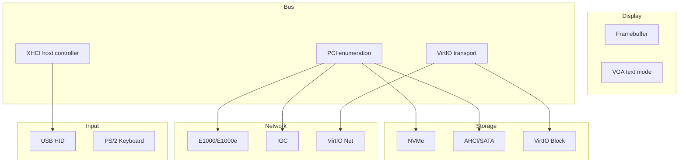
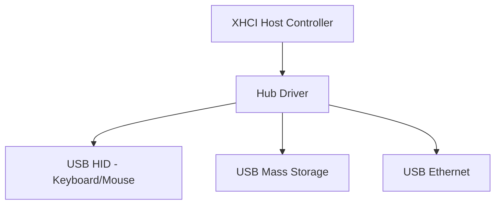
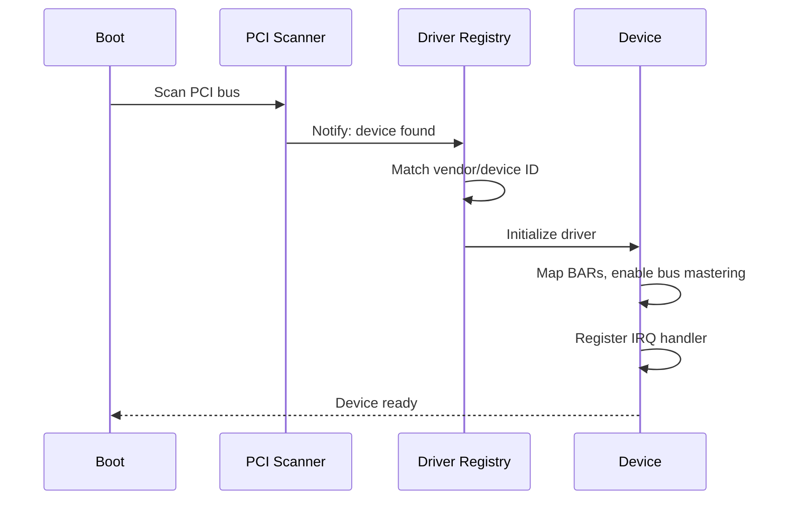

# Driver Model

Strat9 OS uses a trait-based component model for drivers. Each driver registers itself during boot and is discovered through PCI/VirtIO enumeration.

---

## Driver categories



---

## Component trait

All drivers implement the `Component` trait, which provides a uniform registration interface:

```rust
pub trait Component: Send + Sync {
    fn name(&self) -> &str;
    fn init(&self) -> Result<(), ComponentError>;
    fn shutdown(&self);
}
```

Components are registered at boot via the `component-macro` derive macro:

```rust
#[derive(Component)]
struct MyDriver { /* ... */ }
```

---

## PCI enumeration

The PCI bus is scanned at boot using a BFS algorithm with early-exit optimization:

1. For each (bus, device), probe function 0 first
2. If vendor == 0xFFFF → skip all 8 functions (early exit)
3. Read header type bit 7 for multi-function flag
4. If PCI-to-PCI bridge → enqueue secondary bus

This reduces worst-case probes from 65,536 to ~8,192 for typical topologies.

**Key PCI types:**

| Type | Description |
|------|-------------|
| `PciAddress` | Bus/device/function address |
| `PciDevice` | Device info (vendor, class, BARs, IRQ) |
| `ProbeCriteria` | Filter for device discovery |

---

## NIC drivers

### E1000 / E1000e

Intel Ethernet drivers supporting:
- Legacy descriptor rings (T/R)
- MSI-X interrupt moderation
- Multicast filter
- VLAN offload

### IGC

Intel I225/I226 2.5GbE driver with:
- Advanced RX/TX descriptors
- Time-based interrupt coalescing
- Hardware timestamping

### Common NIC infrastructure

| Module | Purpose |
|--------|---------|
| `nic-queues` | TX/RX queue management, descriptor ring abstraction |
| `nic-buffers` | Buffer allocation, DMA-safe memory |
| `net-core` | Packet parsing, protocol headers |
| `driver-net-proto` | Protocol driver trait |

---

## Storage drivers

### NVMe

Full NVMe driver with:
- I/O queues (per-CPU submission/completion pairs)
- MSI-X interrupt steering
- Namespace management
- Admin queue for controller commands

### AHCI / SATA

AHCI controller driver for SATA devices:
- Port enumeration
- DMA PRDT (Physical Region Descriptor Table)
- FIS-based communication

### VirtIO Block

Paravirtualized block device for QEMU/KVM:
- VirtIO queue negotiation
- Multi-queue support
- Feature bits (discard, write cache)

---

## USB stack



The XHCI driver manages the USB host controller, enumerates devices through hub traversal, and dispatches to class-specific drivers (HID, mass storage, etc.).

---

## VirtIO transport

VirtIO provides paravirtualized device access for QEMU/KVM:

| Device | Module | Purpose |
|--------|--------|---------|
| VirtIO Block | `virtio/block` | Block I/O |
| VirtIO Net | `virtio/net` | Network |
| VirtIO Console | `virtio/console` | Serial console |
| VirtIO GPU | `virtio/gpu` | Display |
| VirtIO Input | `virtio/input` | Keyboard/mouse |

---

## Device discovery flow


