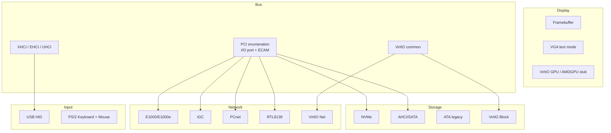
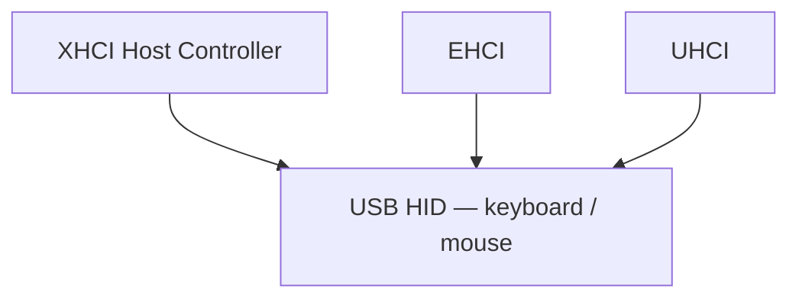
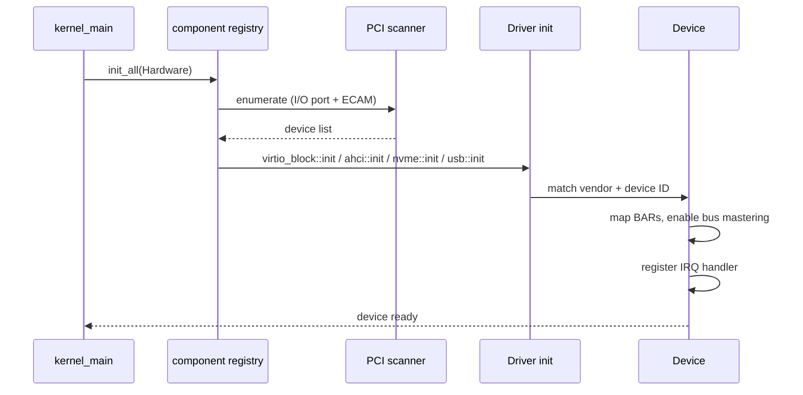

# Driver Model

Strat9 OS does **not** use a driver trait. Drivers are plain modules in the kernel, initialised at boot through a linker-section registry of free functions, and discovered by scanning PCI.

> **Correction to earlier revisions of this page.** There is no `trait Component` and no `#[derive(Component)]`. The real mechanism is a `#[repr(C)]` static placed in a linker section by the `#[init_component]` **attribute macro**. The same correction applies to the crate paths: `component` and `component-macro` live in `workspace/kernel/libs/`, not `workspace/components/`.

---

## Driver categories


```mermaid
graph TB
    subgraph "Storage"
        NVMe[NVMe]
        AHCI[AHCI/SATA]
        ATA[ATA legacy]
        VIO_BLK[VirtIO Block]
    end

    subgraph "Network"
        E1000[E1000/E1000e]
        IGC[IGC]
        PCNET[PCnet]
        RTL[RTL8139]
        VIO_NET[VirtIO Net]
    end

    subgraph "Input"
        USB_HID[USB HID]
        PS2[PS/2 Keyboard + Mouse]
    end

    subgraph "Display"
        FB[Framebuffer]
        VGA[VGA text mode]
        GPU[VirtIO GPU / AMDGPU stub]
    end

    subgraph "Bus"
        PCI[PCI enumeration<br/>I/O port + ECAM]
        VIO[VirtIO common]
        USB[XHCI / EHCI / UHCI]
    end

    PCI --> NVMe
    PCI --> AHCI
    PCI --> E1000
    PCI --> IGC
    PCI --> PCNET
    PCI --> RTL
    VIO --> VIO_BLK
    VIO --> VIO_NET
    USB --> USB_HID
```

---

## Component registration

### The mechanism

`workspace/kernel/libs/component` defines a registration record:

```rust
#[repr(C)]
pub struct ComponentEntry {
    pub name: &'static str,                    // function name, used for dependency resolution
    pub stage: InitStage,                      // lifecycle stage
    pub init_fn: fn() -> Result<(), ComponentInitError>,
    pub path: &'static str,                    // "file!():fn_name", for log messages
    pub priority: u32,                         // lower = earlier within a topological level
    pub depends_on: &'static [&'static str],   // same-stage names that must complete first
}
```

`InitStage` has four values:

| Stage | When |
|-------|------|
| `Bootstrap` | Early kernel init, before SMP |
| `Kthread` | After SMP is up, in kernel-thread context |
| `Hardware` | After the scheduler starts; device and driver probing |
| `Process` | After the first userspace process is created |

`ComponentInitError` is `UninitializedDependencies(String)`, `InitFailed(&'static str)` or `Unknown`.

### Registration

`#[init_component]` from `workspace/kernel/libs/component-macro` is an **attribute macro applied to a free function**, not a derive on a struct:

```rust
#[component::init_component(hardware, priority = 10, depends_on = [acpi_init])]
fn storage_init() -> Result<(), ComponentInitError> {
    virtio_block::init()?;
    ahci::init()?;
    nvme::init()?;
    Ok(())
}
```

The macro expands to a `#[used] static ComponentEntry` placed in the `.component_entries` linker section. `init_all(stage)` walks that section between the `__start_component_entries` and `__stop_component_entries` linker symbols, sorts by `depends_on` and then `priority`, and calls each `init_fn` in order. `list_components()` returns the same set as human-readable metadata.

### What actually registers

`workspace/kernel/src/components.rs` holds the real initialisers. Most `Bootstrap` entries are explicit *markers*, because the work is inlined in `kernel_main` instead. The `Hardware` stage is where drivers genuinely register:

| Stage | Calls |
|-------|-------|
| `Bootstrap` | Mostly markers; see [Boot Sequence → kernel init](./boot-sequence.md#kernel-init--kernelmain) |
| `Kthread` | Kernel-thread start-up |
| `Hardware` | `hardware::init()`, `virtio_block::init()`, `ahci::init()`, `nvme::init()`, `hardware::timer::init()`, `hardware::usb::init()` |
| `Process` | Post-init-process registration (or `process::selftest::create_selftest_tasks()` under the `selftest` feature) |

---

## PCI enumeration

`workspace/kernel/src/arch/x86_64/pci.rs` provides **two** scanners:

1. **I/O-port CF8/CFC scanner** — the classic BFS walk with early-exit optimisation
2. **ECAM / MCFG scanner** — used when ACPI provides an MCFG table

The I/O-port scanner:

1. For each (bus, device), probe function 0 first
2. If vendor == `0xFFFF` → skip all 8 functions (early exit)
3. Read header type bit 7 for the multi-function flag
4. If the device is a PCI-to-PCI bridge → enqueue the secondary bus

That reduces the worst case from 65,536 probes to roughly 8,192 for typical topologies.

### Key types

Defined in `workspace/kernel/src/hardware/pci_client.rs`:

| Type | Description |
|------|-------------|
| `PciAddress` | Bus / device / function address |
| `PciDevice` | Device info: vendor, class, BARs, IRQ |
| `ProbeCriteria` | Filter for device discovery |

Userspace reaches the same functionality through `SYS_PCI_ENUM` (240), `SYS_PCI_CFG_READ` (241) and `SYS_PCI_CFG_WRITE` (242).

---

## NIC drivers

### E1000 / E1000e

`workspace/kernel/src/hardware/nic/e1000*`. Intel Ethernet supporting legacy descriptor rings, MSI-X interrupt moderation, multicast filtering and VLAN offload.

### IGC

Intel I225/I226 2.5GbE: advanced RX/TX descriptors, time-based interrupt coalescing, hardware timestamping.

### Others

`pcnet` and `rtl8139` also live in `kernel/src/hardware/nic/`, alongside `virtio_net` and the shared `common.rs` / `data_plane.rs`.

### Shared NIC crates

Under `workspace/drivers/nic/`:

| Crate | Purpose |
|-------|---------|
| `nic-queues` | TX/RX queue management, descriptor ring abstraction |
| `nic-buffers` | Buffer allocation, DMA-safe memory |
| `net-core` | Packet parsing, protocol headers, `NetworkDevice` / `NetError` |
| `driver-net-proto` | Protocol driver trait |
| `intel-ethernet` | Intel common register definitions |

---

## Storage drivers

These are internal modules in `workspace/kernel/src/hardware/storage/`, wired by `storage_init` in the `Hardware` stage. They are **not** separate crates and are not in a driver registry.

| Module | Notes |
|--------|-------|
| `nvme.rs` | I/O queues per CPU, MSI-X steering, namespace management, admin queue |
| `ahci.rs` | Port enumeration, DMA PRDT, FIS-based command exchange |
| `ata_legacy.rs` | PATA / legacy ATA |
| `virtio_block.rs` | VirtIO queue negotiation, multi-queue, feature bits |

---

## USB stack


```mermaid
graph TD
    XHCI[XHCI Host Controller]
    EHCI[EHCI]
    UHCI[UHCI]
    HID[USB HID — keyboard / mouse]

    XHCI --> HID
    EHCI --> HID
    UHCI --> HID
```

`workspace/kernel/src/hardware/usb/` contains **only** `mod.rs`, `xhci.rs`, `ehci.rs`, `uhci.rs` and `hid.rs`. The module header states the actual scope: host-controller drivers plus HID.

> **There is no hub driver, no mass-storage class driver and no USB Ethernet class driver.** Earlier revisions of this page described a hub → HID / mass-storage / USB-Ethernet hierarchy that does not exist in the tree.

---

## VirtIO

`workspace/kernel/src/hardware/virtio/` holds the common transport plus console, GPU and RNG.

| Device | Real module | Purpose |
|--------|-------------|---------|
| VirtIO Block | `hardware/storage/virtio_block.rs` | Block I/O |
| VirtIO Net | `hardware/nic/virtio_net.rs` | Network |
| VirtIO Console | `hardware/virtio/console.rs` | Paravirtual serial console |
| VirtIO GPU | `hardware/virtio/gpu.rs` | Display; has a live `init()` |
| VirtIO RNG | `hardware/virtio/rng.rs` | Entropy source |

The transport itself is `hardware/virtio/common.rs`.

> There is **no `virtio/input.rs`**. Input is handled by `strate-input` in userspace plus the kernel's PS/2 and USB HID drivers.

---

## Other subsystems

| Subsystem | Location | Status |
|-----------|----------|--------|
| Framebuffer | `kernel/src/framebuffer/` — `x86/`, `gpu/`, `generic.rs` | Active; `aarch64/` is NEON code behind a `cfg` that never compiles today |
| GPU | `kernel/src/hardware/amdgpu/` | Stub driver |
| Thermal | `kernel/src/hardware/thermal.rs` | Present |
| Embedded controller | `kernel/src/hardware/ec.rs` | Present |
| Bus drivers | `workspace/drivers/bus/` (`strat9-bus-drivers`) | 8 SoC bus drivers with their own host test suite |
| Display scheme | `kernel/src/hardware/video/{display_scheme,graphics_adapter}.rs` | Userspace-facing |

---

## Device discovery flow


```mermaid
sequenceDiagram
    participant BOOT as kernel_main
    participant COMP as component registry
    participant PCI as PCI scanner
    participant INIT as Driver init
    participant DEV as Device

    BOOT->>COMP: init_all(Hardware)
    COMP->>PCI: enumerate (I/O port + ECAM)
    PCI-->>COMP: device list
    COMP->>INIT: virtio_block::init / ahci::init / nvme::init / usb::init
    INIT->>DEV: match vendor + device ID
    DEV->>DEV: map BARs, enable bus mastering
    DEV->>DEV: register IRQ handler
    DEV-->>BOOT: device ready
```

Note that the registry hands control to a fixed set of `init()` calls. Matching happens inside each driver, not in a generic registry that drivers plug into.

## See also

- [Architecture Overview](./architecture.md) — where each subsystem sits
- [Boot Sequence](./boot-sequence.md#kernel-init--kernelmain) — the ordered init sequence
- [Syscall Reference → PCI](./syscalls.md#pci) — the userspace-facing PCI syscalls
- `HARDWARE.md` — the hardware support matrix with per-file status
