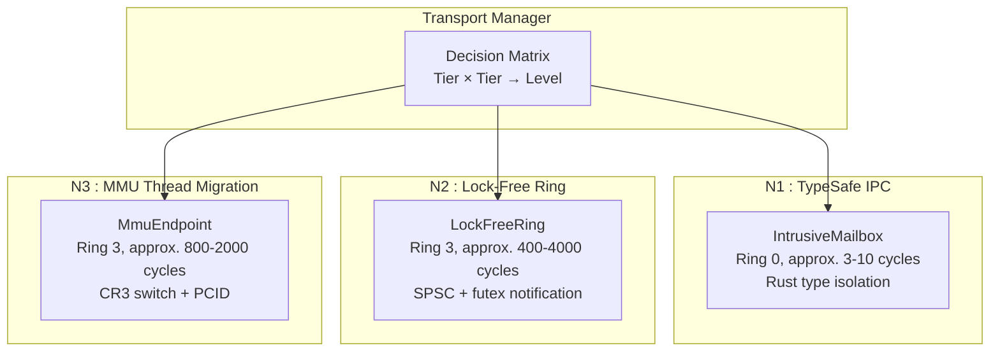

# IPC Mechanisms

Strat9 OS provides a **3-level hybrid IPC transport model** with a central Transport Manager that selects the appropriate isolation level per silo pair. Each level offers a different trade-off between performance and isolation.

---

## IPC Architecture Overview



### Transport selection matrix

| Source \ Dest | Critical | System | User |
|---------------|----------|--------|------|
| **Critical** | N1 (TypeSafe) | N1 (TypeSafe) | N2 (LockFree) |
| **System** | N1 (TypeSafe) | N2 (LockFree) | N2 (LockFree) |
| **User** | N2 (LockFree) | N2 (LockFree) | N3 (MMU) |

---

## N1 : Type-Safe IPC (IntrusiveMailbox)

The fastest transport : kernel-internal, same address space, **approx. 3-10 cycles** per message.

### How it works

Two kernel components (e.g., scheduler ↔ VFS) communicate via an intrusive LIFO mailbox. Messages are linked directly in kernel memory using tagged pointers (x86-64 ABA-safe). No copy, no lock, no syscall.

### Constraints

- **Ring 0 only** : both sender and receiver must be kernel components
- **100% Rust Safe** : `#[forbid(unsafe_code)]` required, `cargo-geiger = 0`
- **LIFO ordering** : not FIFO; use N2 if ordering matters
- **No untrusted input** : forbidden for network, user data, external files

### Usage

```rust
let mailbox = IntrusiveMailbox::new();
mailbox.push(b"notification")?;  // approx. 3 cycles
let msg = mailbox.pop();          // LIFO: last message first
```

---

## N2 : Lock-Free Ring (SPSC)

High-throughput shared-memory transport : **approx. 400-4000 cycles** depending on sleep mode.

### How it works

A lock-free SPSC ring buffer backed by physically contiguous DMA-accessible pages. The producer writes data, sets a Release barrier on `len`, then publishes via `tail.store(Release)`. The consumer observes `tail`, reads data via Acquire, and advances `head`. Futex notification for sleeping consumers.

### Two sub-modes

| Mode | Latency | Use case |
|------|---------|----------|
| **N2a** (busy-poll) | approx. 400 cycles | Hot path, low-latency |
| **N2b** (futex sleep) | approx. 1000-4000 cycles | Background processing |

### Memory layout

```text
Page 0: RingHeader (cache-line padded)
  Line 0: magic, capacity, slot_size, flags, notify_seq
  Line 1: head (consumer hot)  : 60B padding
  Line 2: tail (producer hot)  : 60B padding
Pages 1+: RingSlot entries
  Each: [len:u16][flags:u16][data:u8; SLOT_SIZE]
```

### Usage

```rust
let (producer, consumer) = create_spsc_pair(256);  // 256 slots

// Producer (kernel or Ring 3)
producer.write(b"packet data")?;
producer.notify_consumer();  // futex wake

// Consumer (strate-net, Ring 3)
let mut buf = [0u8; 2048];
let n = consumer.read(&mut buf)?;
```

### NIC integration (data plane)

```text
NIC HW Queue 0 → Ring SPSC 0 → strate-net (poll round-robin)
NIC HW Queue 1 → Ring SPSC 1 →
NIC HW Queue 2 → Ring SPSC 2 →
```

Each RSS queue gets its own SPSC ring : no MPSC contention, no head-of-line blocking.

---

## N3 : MMU Thread Migration (Research Track)

Maximum isolation : **approx. 800-2000 cycles** : currently **research track** with N2 fallback.

### How it works

Inspired by L4 Thread Migration (Liedtke 1995): instead of a full syscall + context switch, the kernel migrates the CPU quantum directly to the target process by switching CR3 (address space) and jumping to the handler. Three tiers:

| Tier | Mechanism | Cost | Condition |
|------|-----------|------|-----------|
| **N3a** | Same-core handoff | approx. 200-400c | Same core, mappings valid |
| **N3b** | PCID-preserving CR3 | approx. 400-800c | PCID active, prefaulted |
| **N3c** | Full migration | approx. 800-2000c | First call, TLB flush |

### Status

⚠️ **Research track** : N3 is not yet implemented. All User↔User pairs fall back to N2 (LockFree Ring).

---

## Legacy mechanisms (still available)

These mechanisms predate the Transport Manager and remain functional:

### IPC Ports (synchronous message-passing)

| Syscall | Description |
|---------|-------------|
| `SYS_IPC_CREATE_PORT` (200) | Create a new port |
| `SYS_IPC_SEND` (201) | Send a message |
| `SYS_IPC_RECV` (202) | Receive a message |
| `SYS_IPC_CALL` (203) | Send and wait for reply |
| `SYS_IPC_REPLY` (204) | Reply to a call |
| `SYS_IPC_BIND_PORT` (205) | Bind to namespace |
| `SYS_IPC_UNBIND_PORT` (206) | Unbind |

### Typed MPMC Channels

```rust
let (tx, rx) = channel::<MyMessage>(64);
tx.send(msg)?;           // blocks if full
let msg = rx.recv()?;    // blocks if empty
```

### Shared Ring (legacy)

High-throughput bulk IPC using shared-memory ring buffers. Superseded by N2 Lock-Free Ring for new code.

### Semaphore

POSIX-like counting semaphore for synchronization.

---

## Transport Manager API

### Creating a transport

```rust
let manager = TransportManager::new();
let result = manager.establish(
    src_silo, dst_silo,
    TransportConfig {
        min_level: TransportLevel::LockFree,
        ring_capacity: Some(256),
        slot_size: None,
    },
)?;
// result.local and result.remote are the endpoints
```

### Dynamic policy override

```rust
// Force N2 for a specific silo pair
manager.set_policy(src_sid, dst_sid, TransportLevel::LockFree, 512);
```

### Syscall interface (planned)

| Syscall | # | Description |
|---------|---|-------------|
| `SYS_TRANSPORT_CREATE` | 240 | Create a transport |
| `SYS_TRANSPORT_SEND` | 241 | Send a message |
| `SYS_TRANSPORT_RECV` | 242 | Receive a message |
| `SYS_TRANSPORT_CLOSE` | 243 | Close transport |
| `SYS_TRANSPORT_INFO` | 244 | Get transport info |

---

## Performance comparison

| Mechanism | Round-trip 64B | CPU usage/pkt | Isolation |
|-----------|---------------|---------------|-----------|
| Legacy IPC (syscall) | approx. 4000 cycles | approx. 2% | MMU |
| N1 TypeSafe | approx. 6-20 cycles | approx. 0.01% | Rust types |
| N2 LockFree (busy) | approx. 400-800 cycles | approx. 0.1% | MMU |
| N2 LockFree (futex) | approx. 1000-4000 cycles | approx. 0.2% | MMU |
| N3 MMU (research) | approx. 800-2000 cycles | approx. 0.5% | MMU (max) |

---

## References

1. Xu, P. & Roscoe, T. (2025) : [The NIC should be part of the OS](https://doi.org/10.1145/3713082.3730388), HotOS'25 : [arXiv](https://arxiv.org/abs/2501.10138)
2. Liedtke, J. (1995) : [On µ-Kernel Construction](https://dl.acm.org/doi/10.1145/224056.224075), SOSP
3. Hunt, G.C. & Larus, J.R. (2007) : [Singularity: Rethinking the Software Stack](https://dl.acm.org/doi/10.1145/1297856.1297873), ACM Queue
4. Levy, A. et al. (2017) : [Multiprogramming a 64kB Computer Safely and Efficiently with Tock](https://dl.acm.org/doi/10.1145/3132617.3132626), SOSP
5. Vyukov, D. : [Bounded MPMC queue](https://github.com/dvyukov/xd/tree/master/bounded_mpmc_queue) : lock-free SPSC/MPMC benchmarks
6. Axboe, J. (2019) : [Efficient IO with io_uring](https://kernel.dk/io_uring-whole.pdf), kernel.org
