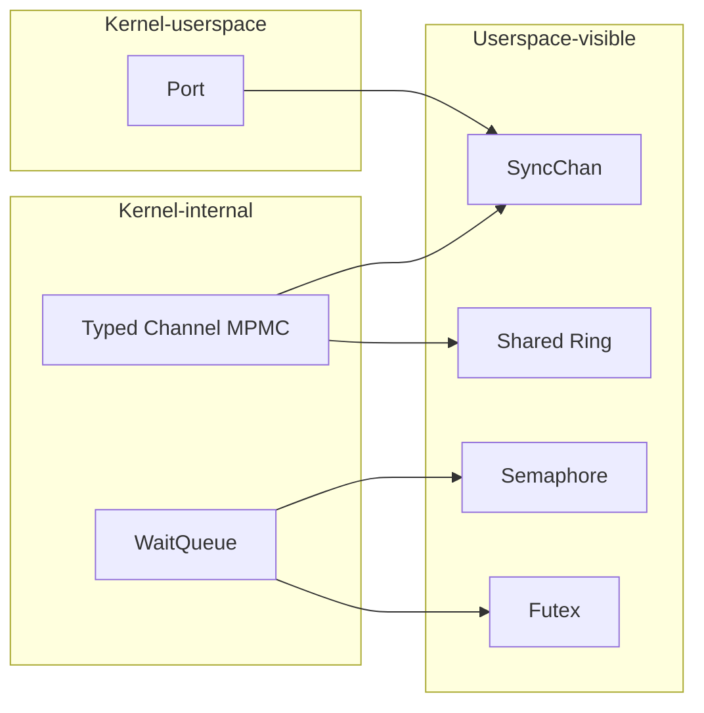
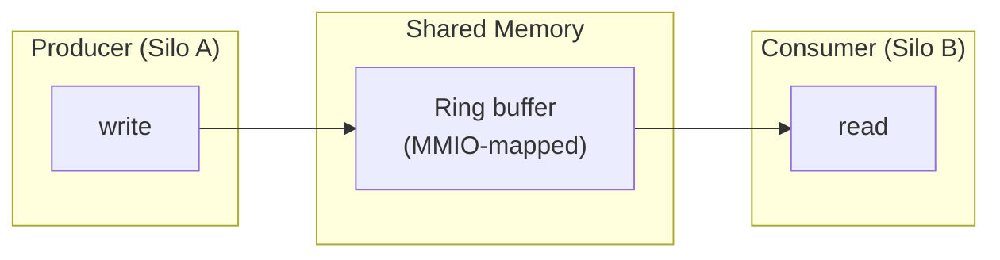

# IPC Mechanisms

Strat9 OS provides several inter-process communication mechanisms, from low-level kernel channels to userspace-accessible shared rings.

---

## IPC overview



---

## Typed MPMC Channel

The fundamental IPC primitive. A typed channel connects producers and consumers with compile-time type safety.

```rust
let (tx, rx) = channel::<MyMessage>(64);  // capacity = 64
tx.send(msg)?;           // blocks if full
let msg = rx.recv()?;    // blocks if empty
```

**Properties:**

- Multi-Producer / Multi-Consumer (both endpoints are `Clone`)
- Bounded capacity with backpressure
- Disconnect detection: receivers see `Err(ChannelError::Disconnected)` when all senders are dropped
- Uses `WaitQueue` for blocking (no polling, no lost-wakeup races)

---

## SyncChan : Symmetric userspace channel

A symmetric channel accessible from userspace via `SYS_CHAN_*` syscalls. Unlike typed kernel channels, SyncChan carries raw `IpcMessage` bytes.

**Syscall interface:**

| Syscall | Description |
|---------|-------------|
| `SYS_CHAN_CREATE` | Create a new SyncChan pair |
| `SYS_CHAN_SEND` | Send a message |
| `SYS_CHAN_RECV` | Receive a message |
| `SYS_CHAN_DESTROY` | Explicitly destroy the channel |

---

## Shared Ring Buffer

High-throughput bulk IPC using shared-memory ring buffers. Designed for scenarios where message copying overhead matters (network packets, disk I/O).



**Properties:**

- Lock-free single-producer / single-consumer (SPSC) variant available
- Physically contiguous frames shared via capability mapping
- Producer/consumer indices stored in the ring header
- Zero-copy: messages stay in the shared buffer

---

## Semaphore

POSIX-like counting semaphore for synchronization between silos.

```rust
let sem = Semaphore::new(0);    // initial count = 0
sem.wait()?;                     // decrement (block if 0)
sem.signal()?;                   // increment (wake waiter)
```

---

## Futex

Fast userspace mutex with kernel fallback. The fast path (uncontended lock/unlock) is entirely in userspace using atomic operations. The kernel only intervenes when a thread needs to block.

```text
Fast path (no contention):
  userspace: atomic CAS on futex word → success

Slow path (contention):
  userspace: SYS_FUTEX_WAIT(futex_word, expected_value)
  kernel:    check word == expected → sleep on wait queue
  kernel:    SYS_FUTEX_WAKE → wake N waiters
```

---

## Port : Kernel-userspace bridge

Ports provide a structured way for kernel subsystems to expose services to userspace. Each port has an associated `PortId` and is accessed through capabilities.

Used by: filesystem schemes, device drivers, network stacks.
