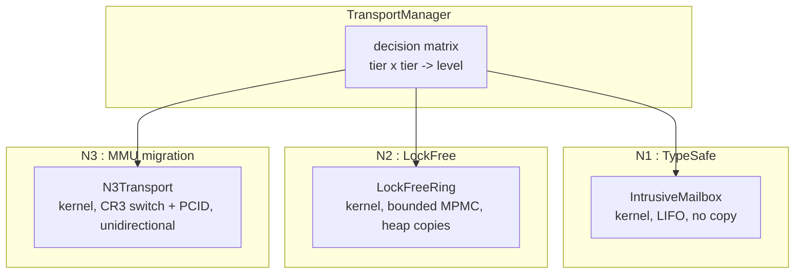

# IPC Mechanisms

Strat9 OS provides a **3-level hybrid IPC transport model**. A central `TransportManager` picks a transport per silo pair from a static tier matrix, overridable by a caller-supplied minimum level.

> **Naming.** The code does not use `N1`/`N2`/`N3` as identifiers — those labels appear in module names and comments only. The real enum is `TransportLevel { TypeSafe = 1, LockFree = 2, Mmu = 3 }` (`kernel/src/ipc/transport.rs:23-32`). This page keeps the N1/N2/N3 labels for continuity with the design docs, but every claim below is checked against the implementation.

---

## Transport levels


```mermaid
graph TB
    subgraph "TransportManager"
        TM[decision matrix<br/>tier x tier -&gt; level]
    end

    subgraph "N1 : TypeSafe"
        N1[IntrusiveMailbox<br/>kernel, LIFO, no copy]
    end

    subgraph "N2 : LockFree"
        N2[LockFreeRing<br/>kernel, bounded MPMC, heap copies]
    end

    subgraph "N3 : MMU migration"
        N3[N3Transport<br/>kernel, CR3 switch + PCID, unidirectional]
    end

    TM --> N1
    TM --> N2
    TM --> N3
```

**All three levels run inside the kernel.** N2 and N3 are not Ring 3 transports: N2's queue lives on the kernel heap, and N3's shared frame and message buffer are mapped kernel-only (no `USER_ACCESSIBLE`, `n3.rs:24-31, 1119-1120`). Only the *data* moving through them originates in userspace.

### Transport selection matrix

Implemented at `kernel/src/ipc/transport.rs:333-381` as `[[TransportPolicyEntry; 3]; 3]`, indexed `[src.tier][dst.tier]`.

| Source \ Dest | Critical (0) | System (1) | User (2) |
|---------------|--------------|------------|----------|
| **Critical (0)** | TypeSafe, cap 0 | TypeSafe, cap 0 | LockFree, cap 256 |
| **System (1)** | TypeSafe, cap 0 | LockFree, cap 256 | LockFree, cap 256 |
| **User (2)** | LockFree, cap 256 | LockFree, cap 256 | Mmu, cap 0 |

The matrix is **asymmetric**: `(Critical, System)` selects TypeSafe while `(System, Critical)` also selects TypeSafe here, but `(Critical, User)` and `(User, Critical)` differ in ordering. Compare cell by cell rather than assuming symmetry.

### How the level is actually chosen

`TransportManager::establish(src: SiloId, dst: SiloId, config: TransportConfig)` (`transport.rs:480-518`) applies three steps in order:

1. **Cache** — a 128-entry FIFO keyed on `(src.sid, dst.sid)`. A hit is returned only if the cached level is at least `config.min_level`.
2. **Policy override** — `policy_overrides` is consulted next. On a hit, `min_level` and the caller's `ring_capacity` are **both ignored**; the override entry alone decides.
3. **Static matrix** — otherwise `level = max(matrix[src][dst], config.min_level)`. `min_level` can only *raise* the level, never lower it.

### ⚠️ The syscall path never selects N1

`sys_transport_create` decodes `config_flags` and defaults the minimum level to `LockFree` (`kernel/src/syscall/transport.rs:38-44`):

```rust
let min_level = match (config_flags & 0xF) as u8 {
    1 => TransportLevel::TypeSafe,
    2 => TransportLevel::LockFree,
    3 => TransportLevel::Mmu,
    _ => TransportLevel::LockFree,   // default
};
```

Because `min_level` is only ever a floor, a caller that does not explicitly pass `1` raises both TypeSafe matrix cells to LockFree. **The N1 mailbox is unreachable through `SYS_TRANSPORT_CREATE`.** It is used only by the kernel-internal NIC ↔ scheduler path (`hardware/nic/mod.rs:197, 214`).

The `config_flags` encoding is:

| Bits | Meaning | Default |
|------|---------|---------|
| `[3:0]` | Minimum level (1 = TypeSafe, 2 = LockFree, 3 = Mmu) | 2 (LockFree) |
| `[23:8]` | Ring capacity in slots | 256 |

### Silo tiers

`SiloTier { Critical = 0, System = 1, User = 2 }` (`kernel/src/silo/mod.rs:29-35`). The tier is **not stored or configured** — it is recomputed from the numeric silo id by `SiloId::new()` on every construction (`silo/mod.rs:46-53`):

| Silo id | Tier |
|---------|------|
| `1..=9` | Critical |
| `10..=999` | System |
| everything else, **including 0** | User |

The selection matrix is therefore a pure function of two integer ranges.

### Endpoint construction

For both TypeSafe and LockFree, `create()` builds **one** object and `Arc::clone`s it into both `local` and `remote` (`transport.rs:529-573`). `TransportCreateResult.local` and `.remote` are the same underlying mailbox/ring — there is no directional split, and a TypeSafe transport has both endpoints pushing and popping the same LIFO stack. Only the Mmu branch is directional, and it is unidirectional by construction.

`sys_transport_create` does not validate that the destination silo exists; it wraps the raw value in `SiloId::new(dst as u32)`.

---

## N1 : Type-Safe IPC (`IntrusiveMailbox`)

`kernel/src/ipc/mailbox.rs`. A lock-free LIFO stack of kernel messages built on intrusive tagged pointers, backed by a preallocated node pool.

### API

| Item | Signature | Location |
|------|-----------|----------|
| `new` | `fn new() -> Self` (preallocates 32 nodes) | `mailbox.rs:188` |
| `new_empty` | `const fn new_empty() -> Self` | `mailbox.rs:201` |
| `preallocate_nodes` | `fn preallocate_nodes(&self, count: usize)` | `mailbox.rs:209` |
| `push` | `fn push(&self, data: &[u8]) -> Result<(), MailboxError>` | `mailbox.rs:218` |
| `pop` | `fn pop(&self) -> Option<IpcMessage>` | `mailbox.rs:256` |
| `is_empty` | `fn is_empty(&self) -> bool` | `mailbox.rs:282` |

Advertised limits (`mailbox.rs:310-317`): 256-byte messages, non-blocking, not zero-copy, single direction, `estimated_cost_cycles: 10`.

### Properties

- **Genuinely LIFO.** Documented at `mailbox.rs:1-8, 87-97`, pinned by the unit test `push_pop_lifo_order` (`mailbox.rs:373-382`) and by the L2 test `kernel-l2-tests/tests/kernel_n1_semaphores.rs:18-32`.
- **Not `#[forbid(unsafe_code)]`.** There is no `forbid`/`deny(unsafe_code)` anywhere under `kernel/src/ipc/`. `mailbox.rs` contains raw `unsafe` dereferences at lines 145, 162, 222, 235, 263 and 273. The only two `forbid(unsafe_code)` attributes in the tree are `kernel/src/ostd/util.rs:8` and `kernel/src/ostd/boot.rs:10`.
- **Kernel-internal only.** Both instances are statics in `kernel/src/ipc/n1.rs`: `NIC_SCHED_MAILBOX` (`:130`) and `SCHED_NIC_MAILBOX` (`:137`). Helpers are `notify_scheduler`, `notify_nic_driver`, `poll_scheduler_events`, `poll_nic_events` (`:151-195`).
- **The preallocation is not actually running.** `ipc::n1::init()` (`n1.rs:141-145`), which calls `preallocate_nodes(32)` on both mailboxes, has no callers anywhere in the kernel. The node pool stays empty and every `push()` falls back to a `Box` heap allocation (`mailbox.rs:229-230`), which defeats the "no heap allocation on the IRQ path" design intent.

### `N1Event`

`n1.rs:84-97` defines a 6-variant `N1Event` with a 2-byte wire encoding (`encode() -> [u8; 2]`, `decode(&[u8])`, `n1.rs:101-119`). The `n1_safe!` macro (`n1.rs:58-75`) is a documentation marker only — it re-emits the annotated function with `#[inline(always)]` and enforces nothing.

---

## N2 : Lock-Free Ring (`LockFreeRing`)

`kernel/src/ipc/lockfree_ring.rs`. A bounded message queue for the general kernel↔kernel and kernel↔silo case.

### What it actually is

- **MPMC, not SPSC.** The implementation wraps `crossbeam_queue::ArrayQueue<Box<[u8]>>` (`lockfree_ring.rs:52`). The module header (`:1-10`) records that a hand-rolled atomic ring was replaced by this.
- **Heap copies, not shared memory.** Each `write` allocates and copies a `Box<[u8]>` (`lockfree_ring.rs:113`). There is no ring buffer in shared pages, no DMA, and no Release/Acquire publish protocol.
- **No futex notification.** `notify_consumer_raw()` and `notify_producer_raw()` are **empty functions** (`lockfree_ring.rs:167, 171`). `wait_notification()` spins 64 times and then loops on `block_current_task()` — a scheduler yield loop, not a futex wait (`:232-245`).
- **No `RingHeader` and no `RingSlot` layout.** No such struct exists. The closest thing in the tree is `async_io::ring::RingMeta` — 5 × `AtomicU32` (head, tail, mask, entries, flags) in a 64-byte header — which belongs to the unrelated io_uring-style async subsystem.
- `dma_buffer(_)` always returns `None`; the `DmaBuffer` type is retained for backward compatibility only (`:187, 204-215`).
- `frame_phys_addrs()` always returns a single-element vector: one dummy `PhysFrame` allocated in `new()` purely for syscall compatibility (`:75-77, 99`).

### API

| Item | Signature | Location |
|------|-----------|----------|
| `new` | `fn new(slot_count: u32, slot_size: usize) -> Result<Arc<Self>, RingError>` — rounds capacity up to a power of two | `lockfree_ring.rs:66` |
| `write` | `fn write(&self, data: &[u8]) -> Result<(), RingError>` | `:109` |
| `read` | `fn read(&self, buf: &mut [u8]) -> Result<usize, RingError>` | `:119` |
| `try_write` / `try_read` | non-blocking variants | `:130` / `:152` |
| `write_vectored` | `fn write_vectored(&self, bufs: &[&[u8]])` | `:135` |
| `has_data` / `has_space` | readiness checks | `:174` / `:179` |

Advertised limits (`transport.rs:218-228`): 2048-byte messages, blocking, not zero-copy, vectored, bidirectional, `estimated_cost_cycles: 400`.

### The unused SPSC wrapper

`transport.rs:672-720` defines a typestate pair — `Producer`, `Consumer`, `TypedLockFreeRing<Role>`, and `create_spsc_pair(cap: u32, slot_size: usize)`. It has **zero call sites** in the repository, and it does not enforce SPSC at runtime: the wrapped `Arc<LockFreeRing>` is a plain MPMC `ArrayQueue`. The `TransportManager` never uses it.

### There are no N2a / N2b sub-modes

`N2a`, `N2b`, `N1a` and `N3a` appear nowhere in the kernel. There is no busy-poll versus futex-sleep distinction in code.

---

## N3 : MMU Thread Migration

`kernel/src/ipc/n3.rs` — **1552 lines of real implementation**, not a stub. Inspired by L4 thread migration: instead of a full syscall plus context switch, the kernel migrates the CPU quantum to the target by switching CR3 and returning into a mapped trampoline.

| Component | Location |
|-----------|----------|
| `N3Tier { PcidPreserving = 1, FullIsolation = 2 }` (named `"n3b"` / `"n3c"`; **there is no N3a**) | `n3.rs:64-69` |
| `N3MinimalContext` — 128 B, `repr(C, align(64))`, r15..rip + `cr3_pcid` + padding; layout pinned by `const _` asserts | `n3.rs:76-100, 196-220` |
| `MigrationFrame` — 320 B, `align(64)`, field offsets asserted | `n3.rs:168-190, 199-206` |
| `N3_SHARED_FRAME_VA = 0xFFFF_C000_0000_1000`, `N3_SHARED_MSG_BUF_VA = 0xFFFF_C000_0000_2000`, `N3_MSG_BUF_SIZE = 2048` | `n3.rs:231, 235, 678` |
| Static frame pool (64 frames) with a bitmap allocator | `n3.rs:256-343` |
| `allocate_pcid` / `free_pcid` / `pcid_available` / `select_n3_tier` | `n3.rs:402, 416, 428, 445` |
| `validate_rip` + `walk_page_tables_executable` (4-level walk, rejects NX and `U/S = 1`) | `n3.rs:464-584` |
| `#[unsafe(naked)] n3b_migrate_asm` — a real `mov cr3, rax; ret` trampoline | `n3.rs:775-844` |
| Migration IPI entry + handler, registered in the IDT at vector `0xF1` | `n3.rs:874-980`, `arch/x86_64/idt.rs:570-572` |
| Watchdog (30 M TSC ≈ 10 ms @ 3 GHz) and recovery path | `n3.rs:987-1096` |
| Kernel-only page mappings for the shared frame and message buffer | `n3.rs:1107-1183` |
| `N3Transport` with `IpcTransport` / `IpcProducer` / `IpcConsumer` | `n3.rs:1190-1533` |

Advertised limits (`n3.rs:1368-1376`): 2048-byte messages, blocking, not zero-copy, unidirectional, `estimated_cost_cycles: 800`.

### ⚠️ N3 sends fail on the current task model

`N3Transport::send()` requires the receiver's `task.trampoline_entry != 0` (`n3.rs:1405-1408`) and then requires that RIP to pass `validate_rip()`, which rejects:

- any `rip >= 0xFFFF_8000_0000_0000` (`n3.rs:466`), and
- any page with `U/S = 1` — i.e. userspace pages — at every level of the walk (`n3.rs:524, 536, 557, 576`).

But every kernel task constructor initialises `trampoline_entry: AtomicU64::new(0)` (`fork.rs:277`, `thread_ops.rs:283`, `task.rs:1032, 1114`), and the only non-zero assignment in the tree is a userspace ELF entry point (`elf.rs:2256`) — which is precisely what the validator rejects.

`N3Transport::new()` does not check any of this, so a User↔User transport is **created successfully** and then fails on the first `send()` with `IpcError::InvalidRip` → `EFAULT`. There is no fallback to N2.

### Other caveats

- `n3.rs:40` carries a module-level `#![allow(dead_code)]`.
- `n3.rs` contains **no `#[cfg(test)]` tests**.
- `workspace/kernel-l2-tests/src/mirror/ipc.rs:171` still declares `zero_copy: true` for `LockFreeRing`, contradicting the kernel's `false`.

---

## Syscall interface

**These are implemented and dispatched**, not planned. Numbers from `workspace/abi/src/syscall.rs:379-412`, wiring from `kernel/src/syscall/dispatcher.rs:221-225`.

| Syscall | # | Kernel args | Returns | Behaviour |
|---------|---|-------------|---------|-----------|
| `SYS_TRANSPORT_CREATE` | 260 | `dst_silo: u64, config_flags: u64` | transport capability | Resolves the source silo from the caller, decodes `config_flags`, calls `establish()`, and inserts an `IpcTransport` capability with read/write permission |
| `SYS_TRANSPORT_SEND` | 261 | `transport_handle, buf_ptr, buf_len` | bytes sent | Capability check, user-slice copy, `endpoint.send()`, bump `stats.sent` |
| `SYS_TRANSPORT_RECV` | 262 | `transport_handle, buf_ptr, buf_len` | bytes received | Mirror of send; rejects `buf_len == 0` |
| `SYS_TRANSPORT_CLOSE` | 263 | `transport_handle: u64` | `0` | Removes the capability only. The actual `TransportManager::close()` runs later, from `capability.rs:473-478`, when the last reference drops |
| `SYS_TRANSPORT_INFO` | 264 | `transport_handle, out_ptr` | `0` | Writes **8 bytes**: the `TransportLevel` discriminant |

> `SYS_TRANSPORT_INFO` does **not** write a `TransportInfo` struct — no such type exists in the repository, despite the ABI header describing one. See [Syscall Reference → IPC: transport](./syscalls.md#ipc--transport-n1n2n3).

Both send and recv are **non-blocking in practice** even though the N2 and N3 endpoints advertise `blocking: true`: a full or empty ring maps to `IpcError::WouldBlock` → `EAGAIN`.

`ResourceType::IpcTransport` is a first-class pollable: `poll_handle_events` reports `HANDLE_EVENT_READABLE` from `endpoint.has_data()` and `HANDLE_EVENT_WRITABLE` from `endpoint.has_space()` (`transport.rs:414-438`).

There are no unit tests for `syscall/transport.rs` or `ipc/transport.rs`.

---

## Legacy mechanisms (still available and functional)

These predate the Transport Manager and remain dispatched.

### IPC ports (synchronous message-passing)

`kernel/src/ipc/port.rs`. Each `Port` holds a bounded `ArrayQueue<IpcMessage>` of **16** entries (`port.rs:17`), plus send/receive wait queues for blocking.

| Syscall | # | Kernel args |
|---------|---|-------------|
| `SYS_IPC_CREATE_PORT` | 200 | `flags: u64` (ignored) |
| `SYS_IPC_SEND` | 201 | `port_handle, msg_ptr` |
| `SYS_IPC_RECV` | 202 | `port_handle, msg_ptr` |
| `SYS_IPC_CALL` | 203 | `port_handle, msg_ptr` |
| `SYS_IPC_REPLY` | 204 | `msg_ptr` |
| `SYS_IPC_BIND_PORT` | 205 | `port_handle, name_ptr, name_len` |
| `SYS_IPC_UNBIND_PORT` | 206 | `path_ptr, path_len` (by name) |
| `SYS_IPC_TRY_RECV` | 207 | `port_handle, msg_ptr` |
| `SYS_IPC_CONNECT` | 208 | `path_ptr, path_len` (by name) |

Messages are fixed-size `IpcMessage` values: 256 bytes, 64-byte aligned, 16-byte header, 240-byte payload (`workspace/abi/src/data.rs:12-21`). There is no user-supplied length.

Port creation, send and receive each reserve against a per-process `ipc_quota`; exceeding it returns `ENOMEM`. The kernel injects a capability badge into `msg.sender` instead of a raw task id.

Self-tested in-kernel at `kernel/src/ipc/test.rs:34-112`.

### Typed MPMC channels

`kernel/src/ipc/channel.rs`. Two layers: a generic `channel::<T>(cap) -> (Sender<T>, Receiver<T>)` with cloneable MPMC endpoints and disconnect detection (`:110-341`), and `SyncChan` (`:356`) registered in a global table under a `ChanId` (`:516-560`) for userspace access.

| Syscall | # | Kernel args |
|---------|---|-------------|
| `SYS_CHAN_CREATE` | 220 | `capacity: u64` (clamped to 1..=1024) |
| `SYS_CHAN_SEND` | 221 | `handle, msg_ptr` |
| `SYS_CHAN_RECV` | 222 | `handle, msg_ptr` |
| `SYS_CHAN_TRY_RECV` | 223 | `handle, msg_ptr` |
| `SYS_CHAN_CLOSE` | 224 | `handle` |

Message size is pinned to 256 bytes by a `const _` assertion in `syscall/chan.rs:21-24`. Self-tested at `ipc/test.rs:134-225` and by `kernel-l2-tests/tests/kernel_channels.rs`.

### Shared rings

`kernel/src/ipc/shared_ring.rs`. Maps user-accessible shared pages; `SYS_IPC_RING_CREATE` (210) takes the ring size and `SYS_IPC_RING_MAP` (211) takes a handle and a desired address.

> The ABI header calls the first argument `size_log2`; the handler passes it through as a **byte size** (`syscall/ipc_ring.rs:15-16`).

Self-tested at `ipc/test.rs:245-277`.

### Semaphores

`kernel/src/ipc/semaphore.rs`. `PosixSemaphore { count: AtomicI32, destroyed, waitq }` with a signal-interruption-aware `wait()`, plus `try_wait`, `post` and `count`.

| Syscall | # |
|---------|---|
| `SYS_SEM_CREATE` | 230 |
| `SYS_SEM_WAIT` | 231 |
| `SYS_SEM_TRYWAIT` | 232 |
| `SYS_SEM_POST` | 233 |
| `SYS_SEM_CLOSE` | 234 |

Self-tested at `ipc/test.rs:279-319` and by `kernel-l2-tests/tests/kernel_n1_semaphores.rs:54-100`.

### Reply routing and lifecycle

- `ipc/reply.rs` — `register_ring_call`, `deliver_reply`, `cancel_replies_waiting_on`, used by `SYS_IPC_CALL` and by `AsyncOp::IpcCall`.
- `ipc/lifecycle.rs` — `MultiHandleDestroyError` / `MultiHandleResource` for multi-capability teardown.
- `ipc/quota.rs` — `IpcQuota` / `QuotaExceeded`.

---

## Async I/O (separate subsystem)

`kernel/src/async_io/` is **not** part of the N1/N2/N3 transport layer. It is an io_uring-style submission/completion ring subsystem, reached through `SYS_ASYNC_SETUP` (250) … `SYS_ASYNC_DESTROY` (254).

- `ring.rs:26-59` — `Ring { id, owner_pid, sq_frame/sq_virt, cq_frame/cq_virt, entries, in_flight, destroyed, cq_lock, completion_backlog, wq }`; registry capped at `MAX_RINGS = 128` (`:307-309`).
- `ops.rs` — a 19-variant `AsyncOp` enum (`:13-56`): IPC ops at 10-12, storage at 50-51, `Cancel` at 254. `AsyncSqe` is 64 B, `AsyncCqe` is 16 B, `MAX_IN_FLIGHT = 4096`, `DEFAULT_RING_ENTRIES = 256`.
- `dispatch.rs` — `drain_submissions` (`:34`), `dispatch_one` (`:69`), IPC handling at `:140-209`.
- `sys_async_cancel` returns `SyscallError::NotImplemented` (`async_io/syscall.rs:128-132`).
- Open work is listed in `async_io/mod.rs:11-25`: async read/write/open/close/stat, `IpcCall`, `PollAdd`/`PollRemove`, timeouts, accept/connect, a real `Cancel`, a `libasync` userspace runtime, and a safety audit.

---

## Performance figures

**No measurement backs any cycle or CPU figure.** There is no IPC benchmark in the repository — no `criterion`, `divan` or `iai` harness anywhere under `kernel/`, `abi/` or `kernel-l2-tests/`. The only TSC read in the IPC tree is the N3 watchdog timestamp (`n3.rs:668`), not a throughput counter.

The only numbers present in code are three hardcoded `estimated_cost_cycles` literals returned by each level's `capabilities()`:

| Level | Literal | Location |
|-------|---------|----------|
| TypeSafe | `10` | `mailbox.rs:316` |
| LockFree | `400` | `transport.rs:227` |
| Mmu | `800` | `n3.rs:1375` |

These are scheduler hints, and **nothing reads `estimated_cost_cycles`** anywhere in the tree.

Treat every range previously quoted for N1 (3-10 cycles), N2 (400-4000), N3 (800-2000), the per-tier N3 costs, and the CPU-usage-per-packet figures as unverified design targets. The only defensible statement today is the three literals above.

---

## See also

- [Syscall Reference → IPC: transport](./syscalls.md#ipc--transport-n1n2n3)
- [Silo System](./silo.md) — silo lifecycle, pledge/unveil
- [IPC Transport Architecture](./architecture-ipc-access-levels.md) — the full access-level design note
- [Architecture Overview](./architecture.md)

### References

1. Xu, P. & Roscoe, T. (2025) : [The NIC should be part of the OS](https://doi.org/10.1145/3713082.3730388), HotOS'25 : [arXiv](https://arxiv.org/abs/2501.10138)
2. Liedtke, J. (1995) : [On µ-Kernel Construction](https://dl.acm.org/doi/10.1145/224056.224075), SOSP
3. Hunt, G.C. & Larus, J.R. (2007) : [Singularity: Rethinking the Software Stack](https://dl.acm.org/doi/10.1145/1297856.1297873), ACM Queue
4. Levy, A. et al. (2017) : [Multiprogramming a 64kB Computer Safely and Efficiently with Tock](https://dl.acm.org/doi/10.1145/3132617.3132626), SOSP
5. Vyukov, D. : [Bounded MPMC queue](https://github.com/dvyukov/xd/tree/master/bounded_mpmc_queue)
6. Axboe, J. (2019) : [Efficient IO with io_uring](https://kernel.dk/io_uring-whole.pdf)
