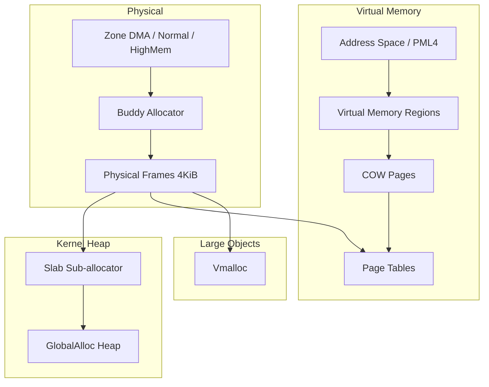
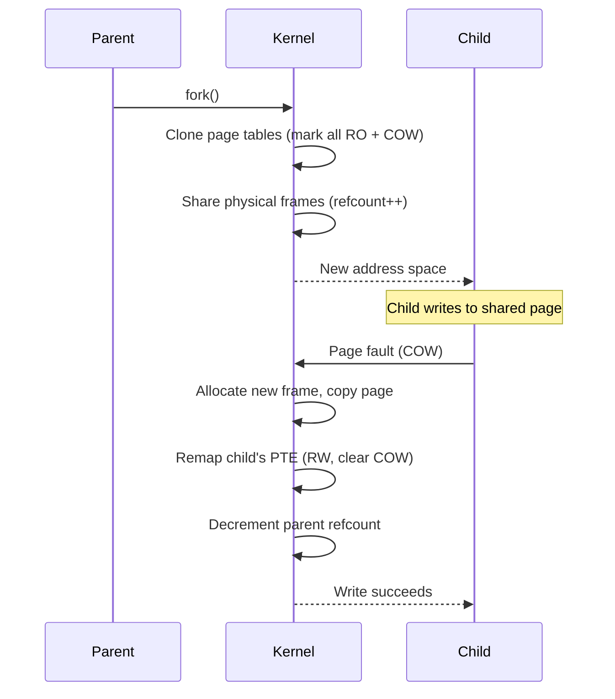

# Memory Management

Strat9 OS uses a layered memory architecture: physical frame allocation (buddy), kernel heap (slab), virtual memory (page tables + COW), and large-object allocation (vmalloc).

---

## Memory hierarchy



---

## Buddy allocator

The buddy allocator manages physical frames. It divides memory into zones (DMA, Normal, HighMem) and uses a free-list per order (0–10) for power-of-two allocations.

**Key properties:**

- Order-0 allocations go through per-CPU caches (`LOCAL_FRAME_CACHES`) for O(1) fast path
- Cross-CPU stealing when local cache is empty
- Compaction assist when high-order allocations fail
- Refcount sentinel: free-list frames carry `REFCOUNT_UNUSED` (u32::MAX)

```text
alloc order-0:
  1. Try local cache (per-CPU, PreemptDisabled lock)
  2. Refill cache from buddy global
  3. Steal from other CPU caches
  4. Fallback to global buddy allocator
```

---

## Slab heap

The kernel heap uses a slab sub-allocator for small objects (≤ 2048 bytes). Each size class has its own free list backed by whole pages from the buddy allocator.

| Class size | Typical use |
|------------|-------------|
| 16 B | Small structs, list nodes |
| 32 B | Capability entries |
| 64 B | IPC message headers |
| 128 B | Task control blocks |
| 256 B | VMA entries |
| 512 B | Pathname buffers |
| 1024 B | Syscall argument buffers |
| 2048 B | Large temporary buffers |

Allocations > 2048 bytes go directly to the buddy allocator via `vmalloc`.

---

## Copy-on-Write (COW)

COW enables efficient `fork()` by sharing physical frames between parent and child.



**COW refcount invariant:**

- refcount == 1 → sole owner (no sharing)
- refcount > 1 → shared (writes trigger COW fault)
- refcount == REFCOUNT_UNUSED → free-list frame

---

## Page tables

The kernel uses x86_64 4-level paging (PML4 → PDPT → PD → PT).

| Level | Covers | Entry size |
|-------|--------|-----------|
| PML4 | 512 GiB | 8 bytes |
| PDPT | 1 GiB | 8 bytes |
| PD | 2 MiB (huge) | 8 bytes |
| PT | 4 KiB | 8 bytes |

**Address space layout:**

- `PML4[0..256]` → user space (per-process)
- `PML4[256..512]` → kernel space (shared across all processes)

Each user process gets a fresh PML4 with the kernel half cloned from the boot PML4. This shares kernel L3/L2/L1 subtrees : kernel mapping changes propagate automatically.

---

## Vmalloc

Large non-contiguous allocations use `vmalloc`, which maps arbitrary physical pages into a contiguous virtual range. Used for:

- Large metadata arrays
- Buffers that don't need physical contiguity
- Allocations > buddy max order
