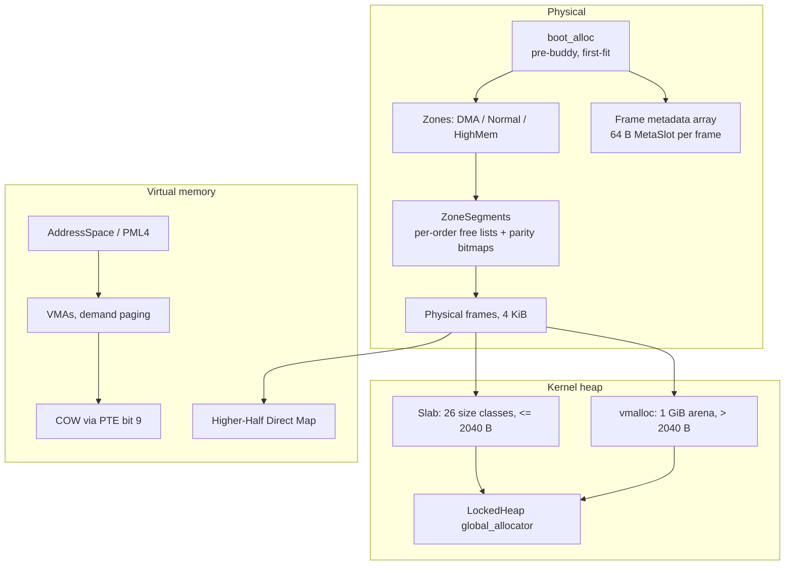

# Memory Management

Strat9 OS uses a layered memory architecture: a pre-boot physical allocator, a real buddy frame allocator with per-CPU caches, a slab kernel heap with a vmalloc large-object backend, four-level page tables with an HHDM and copy-on-write, and demand paging for user VMAs.

---

## Memory hierarchy


```mermaid
graph TB
    subgraph "Physical"
        BOOTALLOC[boot_alloc<br/>pre-buddy, first-fit]
        ZONES[Zones: DMA / Normal / HighMem]
        SEG[ZoneSegments<br/>per-order free lists + parity bitmaps]
        META[Frame metadata array<br/>64 B MetaSlot per frame]
        FRAMES[Physical frames, 4 KiB]
    end

    subgraph "Kernel heap"
        SLAB[Slab: 26 size classes, <= 2040 B]
        VMALLOC[vmalloc: 1 GiB arena, > 2040 B]
        GLOBAL[LockedHeap global_allocator]
    end

    subgraph "Virtual memory"
        AS[AddressSpace / PML4]
        VMA[VMAs, demand paging]
        COW[COW via PTE bit 9]
        HHDM[Higher-Half Direct Map]
    end

    BOOTALLOC --> ZONES
    ZONES --> SEG
    BOOTALLOC --> META
    SEG --> FRAMES
    FRAMES --> SLAB
    FRAMES --> VMALLOC
    SLAB --> GLOBAL
    VMALLOC --> GLOBAL
    AS --> VMA
    VMA --> COW
    FRAMES --> HHDM
```

## Module map

| File | Lines | Role |
|------|-------|------|
| `memory/buddy.rs` | 2770 | Physical frame allocator, per-CPU caches, fragmentation telemetry |
| `memory/address_space.rs` | 2257 | Per-process PML4, VMAs, effective mappings, demand paging, COW clone |
| `memory/vmalloc.rs` | 1142 | VM-backed large-allocation arena |
| `memory/heap.rs` | 1098 | `#[global_allocator]` — slab + vmalloc dispatch |
| `memory/frame.rs` | 955 | Per-frame `MetaSlot` metadata, `FrameAllocOptions`, `REFCOUNT_UNUSED` |
| `memory/boot_alloc.rs` | 571 | Pre-buddy physical allocator used during early init |
| `memory/paging.rs` | 563 | `OffsetPageTable` wrapper, HHDM helpers, `BuddyFrameAllocator` |
| `memory/userslice.rs` | 530 | User-pointer validation, `USER_SPACE_END` |
| `memory/zone.rs` | 468 | `ZoneType`, `Migratetype`, `Zone`, `ZoneSegment`, `BuddyBitmap` |
| `memory/region_cap.rs` | 333 | Exported memory-region capability registry |
| `memory/ownership.rs` | 322 | `OwnershipTable` — capability refcounts for shared blocks |
| `memory/cow.rs` | 128 | COW flag helpers and the transient COW pin |
| `memory/block.rs` | 140 | `BlockHandle` and the typestate `PhysBlock<S>` |
| `memory/mapping_index.rs` | 92 | `CapId` → live mappings reverse index |
| `memory/block_meta.rs` | 50 | `resolve_handle()` compatibility shim |

There is **no `memory/alloc.rs`**. The only kernel `#[global_allocator]` is in `heap.rs`.

---

## Boot allocator (pre-buddy)

`memory/boot_alloc.rs` serves the allocations needed *before* the buddy exists: the frame metadata array, the buddy bitmaps, and the segment tables.

- `BootAllocator { regions: [BootRegion; 512], len, accessible_limit }`, first-fit over sorted, merged `Free` + `Reclaim` extents
- `MAX_BOOT_ALLOC_REGIONS = 512`, `MAX_PROTECTED_RANGES = 32`
- `try_alloc_accessible` is gated on `is_hhdm_range_mapped_now`, so it refuses addresses the HHDM cannot currently translate
- `boot_alloc::seal()` is called at the end of buddy init (`buddy.rs:185`); the allocator refuses further allocations afterwards

There is **no E820 parser** anywhere in the workspace. The map comes from the UEFI bootloader's `GetMemoryMap()`; see [Boot Sequence](./boot-sequence.md).

---

## Buddy allocator

A real buddy allocator modelled on Linux's design.

- `BuddyAllocator { zones: [Zone; 3], bitmap_pool: [(u64, u64); 3] }`
- Each `Zone` is a **range-split container of `ZoneSegment`s**, not a flat bitmap: each segment owns its per-order free lists and parity bitmaps, and segment lookup is a binary search
- `free_lists: [[u64; MAX_ORDER + 1]; Migratetype::COUNT]` per segment
- Coalescing uses per-order parity bitmaps (`insert_free_block`, `toggle_pair`, `buddy_phys`)
- **Free-list links live in the out-of-band `MetaSlot`, never in page bytes**
- Global lock: `static BUDDY_ALLOCATOR: SpinLock<Option<BuddyAllocator>>`
- Every alloc/free takes an `IrqDisabledToken`, a compile-time proof that interrupts are disabled

### Orders

`MAX_ORDER = 11` → orders 0..=11, i.e. 4 KiB up to **8 MiB**. Allocations above order 11 are rejected.

### Zones

| Zone | Range | Default migratetype |
|------|-------|---------------------|
| `DMA` (`ZoneType::DMA = 0`) | 0 .. 16 MiB | Unmovable |
| `Normal` (`ZoneType::Normal = 1`) | 16 MiB .. 896 MiB | Unmovable |
| `HighMem` (`ZoneType::HighMem = 2`) | above 896 MiB | Movable |

Each zone enforces watermarks and a lowmem reserve before it will accept another allocation. Scan order depends on migratetype: Unmovable scans Normal → HighMem → DMA, while Movable scans **HighMem → Normal → DMA** so that pageable allocations do not consume low memory. A failed allocation is retried once with watermarks ignored.

### Migratetypes

`Migratetype { Unmovable = 0, Movable = 1 }`. Each segment carries a free list per (order, migratetype), and 2 MiB pageblocks are tagged so that a pageblock's migratetype is stable. `fallback_order()` allows bidirectional cross-class borrowing when one class is exhausted. Merging a block with a buddy of a different migratetype is refused.

### Per-CPU caches

- `LOCAL_FRAME_CACHES: [SpinLock<LocalFrameCache, PreemptDisabled>; LOCAL_CACHE_SLOTS]`
- `LOCAL_CACHE_SLOTS = Migratetype::COUNT * MAX_CPUS` = 2 × 32 = **64 slots**
- `LOCAL_CACHE_CAPACITY = 256` frames per cache
- `LOCAL_CACHE_REFILL_ORDER = 4` (16 pages), `LOCAL_CACHE_FLUSH_BATCH = 64`
- Cacheability filter: Unmovable caches draw **only from Normal**; Movable caches draw from **Normal + HighMem, never DMA**

```text
alloc order-0:
  1. Take from the local per-CPU cache
  2. Refill the cache from the buddy free lists (one order-4 block)
  3. Steal from another CPU's cache
  4. Fall back to the global buddy allocator
```

### Refcount sentinel

`REFCOUNT_UNUSED: u32 = u32::MAX` (`memory/frame.rs:81`).

| Refcount | Meaning |
|----------|---------|
| `REFCOUNT_UNUSED` | Frame sits on a free list |
| `1` | Sole owner, not shared |
| `> 1` | Shared, writes trigger a COW fault |

`FrameAllocOptions::allocate` performs a fail-fast `cas_refcount(REFCOUNT_UNUSED, 1)` and panics on mismatch, and `mark_block_allocated` carries a matching `debug_assert_eq!`.

### Frame metadata

A 64-byte `MetaSlot` is allocated for **every** 4 KiB frame at boot, out of band from `boot_alloc`. The layout contract is `refcount` at byte offset 32.

- `meta_guard::{NONE, KERNEL_ONLY, POISONED}`
- `frame_flags::{ALLOCATED, FREE, KERNEL, USER, POISONED, MOVABLE, COW, DLL, ANONYMOUS, DMA}`
- `FrameMetaVtable { on_last_ref, on_unmap, … }` teardown hooks, dispatched from `release_owned_block`
- `FrameAllocOptions` / `FramePurpose` policy: page-table frames are force-zeroed, others are zeroed by default
- Poisoned blocks are quarantined and never recycled
- Debug builds keep a double-alloc / double-free bitmap
- Per-order allocation-failure counters and per-order fragmentation scores feed `dump_diagnostics()`

### "Compaction" is compaction-*assist*, not compaction

There is **no page migration**: no `migrate_page`, no pageblock relocation, no `MIGRATE_*` types. What exists is a fragmentation-score-gated **drain of the per-CPU order-0 caches** when a high-order allocation fails.

- `COMPACTION_FRAGMENTATION_THRESHOLD` defaults to **35**; `set_compaction_threshold` can change it at runtime
- `compaction_candidate()` and `compaction_drain_budget()` select the victim zones; `alloc_migratetype` invokes the assist on a miss
- `CompactionStats` counters are dumped from the IDT panic path

`workspace/assets/boot/kernel.toml` sets `[buddy] compaction_threshold = 35`, but `boot::config::apply_kernel_config()` is currently a no-op stub, so the file is not read at boot.

---

## Slab kernel heap

`memory/heap.rs` implements `unsafe impl GlobalAlloc` for `LockedHeap`, registered as `#[global_allocator]`. An `#[alloc_error_handler]` provides extensive OOM diagnostics.

- `SlabState { partial_pages: [*mut SlabPageHeader; NUM_SLABS] }` behind a spinlock
- A 24-byte `SlabPageHeader` lives at byte 0 of every buddy-drawn 4 KiB page; a refill takes one order-0 page from the buddy and carves it
- Pages that become completely empty are returned to the buddy allocator
- **Corruption detection is on unconditionally**: `HEAP_POISON_ENABLED = true`, poison byte `0xDE`, canary `0xDEAD_BEEF`, 8-byte tail redzone. Every allocation memsets the body and every deallocation verifies the canary

### Size classes

**26 classes**, not powers of two. The progression is roughly 1.25× above 64 bytes:

```text
  8,  16,  24,  32,  48,  64,  80,  96, 112, 128, 160, 192,
224, 256, 320, 384, 448, 512, 640, 768, 896, 1024, 1280, 1536,
1792, 2048
```

Each class guarantees alignment equal to its largest power-of-two divisor — for example 24 → 8, 48 → 16, 80 → 16, 112 → 16, 160 → 32, 192 → 64, 320 → 64, 640 → 128, 896 → 128, 1280 → 256, 1792 → 256. Blocks per page is `(4096 - align_up(24, class_align)) / class_size`, so the 2048 class fits exactly one block per page.

### The cut-over is 2040 bytes, not 2048

`MAX_SLAB_SIZE = SLAB_SIZES[last] - REDZONE_TAIL` = 2048 − 8 = **2040**. The backend is chosen on `effective = max(layout.size(), layout.align())`: at or below 2040 the slab serves the request, above it the allocation goes to vmalloc. A class only matches if `size + 8 <= class_size` and `align <= class_alignment`. The large path rejects `align > 4096`, since vmalloc only guarantees 4 KiB alignment.

---

## Vmalloc

`memory/vmalloc.rs` is the large-object backend, not a separate API used only for oversized buddy orders.

| Constant | Value |
|----------|-------|
| `VMALLOC_VIRT_START` | `0xffff_c000_0000_0000` |
| `VMALLOC_SIZE` | 1 GiB |
| `VMALLOC_VIRT_END` | `0xffff_c040_0000_0000` |
| `ARENA_START_PAGE` | 1 (page 0 stays mapped as an anchor) |

The arena lives at **PML4[384]**, in the shared kernel half. `ensure_kernel_subtree_ready()` permanently maps a bootstrap frame at `VMALLOC_VIRT_START` so the PDPT/PD/PT subtree is inherited by every address space cloned later.

- Intrusive `VmallocNode` free-extent and live-allocation lists, carved from **raw buddy pages rather than the heap**, deliberately, to avoid allocator recursion
- Best-fit virtual range reservation with coalescing of adjacent free extents
- `vfree` runs in three phases — unmap under the lock, release the lock, then TLB shootdown and frame release — specifically to avoid holding a spinlock across an IPI
- Per-allocation attribution (task, pid, tid, silo, size, sequence, callsite) powers leak analysis
- Backed by **individual order-0 buddy frames**, mapped into a contiguous virtual range — not by high-order buddy blocks

There is **no path that routes "allocations larger than the buddy max order" to vmalloc**. The only automatic trigger is the 2040-byte heap cut-over; everything else is an explicit `allocate_kernel_virtual()` call.

---

## Copy-on-Write

COW is implemented and wired into the real page-fault path.

### The COW marker is PTE bit 9

`const COW_BIT: PageTableFlags = PageTableFlags::BIT_9` — set in the parent during clone and checked by the fault handler. This is distinct from the `frame_flags::COW` metadata bit, which is a separate concept.

### Clone side

`AddressSpace::clone_cow()` (`address_space.rs:1846+`) walks every writable effective mapping, clears WRITABLE, sets the COW bit in the parent, maps the same physical frame in the child, takes a transient ownership pin, registers a child `EffectiveMapping` under a **new** `CapId`, then drops the pin. The child is mapped writable first and downgraded afterwards so intermediate PDPT/PD levels are created writable. Any error rolls the whole clone back.

### Fault side

`handle_cow_fault(virt_addr, address_space)` (`syscall/fork.rs:395-627`):

1. Reject if the PTE lacks bit 9
2. `refcount == 1` → simply add WRITABLE, clear COW, `invlpg`
3. `refcount > 1` → allocate (order 0 for 4 KiB, **order 9** for 2 MiB), `copy_nonoverlapping`, unmap and remap, roll back on any failure, initialise the new handle's refcount
4. Both `VmaPageSize::Small` and `VmaPageSize::Huge` are handled

`page_fault_handler` (`arch/x86_64/idt.rs:853-1085`) tries COW **first**, and only for a `PROTECTION_VIOLATION` caused by a write in user mode. Otherwise it falls through to `AddressSpace::handle_fault()` for demand paging. A present page that takes a protection violation is explicitly **not** retried.

### Refcount ownership

Refcounts live in two layers:

1. **`OwnershipTable`** (`memory/ownership.rs`) is authoritative. `OwnerEntry { state, refcount, caps, transient_refs }` in a single spinlocked `BTreeMap`, with `BlockState { BuddyReserved, Exclusive, Shared, Free }` and `RemoveRefResult { Freed, NowExclusive, StillPinned, StillShared }`. The COW transient pin is `pin()` / `unpin()`.
2. **`MetaSlot.refcount`** mirrors it via `sync_meta` and doubles as the buddy free-list sentinel. Reads prefer the ownership table and fall back to metadata.

---

## Page tables

Four-level x86_64 paging: PML4 → PDPT → PD → PT. There is no LA57/5-level support; the translation walker uses fixed shifts `[39, 30, 21, 12]`.

| Level | Covers | Entry size |
|-------|--------|-----------|
| PML4 | 512 GiB | 8 bytes |
| PDPT | 1 GiB | 8 bytes |
| PD | 2 MiB (huge) | 8 bytes |
| PT | 4 KiB | 8 bytes |

### Address space layout

| Region | Location | PML4 slot |
|--------|----------|-----------|
| User space | low half | `0..256` |
| Kernel image | `0xFFFF_FFFF_8000_0000` | `511` |
| HHDM | `0xFFFF_FF00_0000_0000` | `510` |
| vmalloc arena | `0xffff_c000_0000_0000` | `384` |
| Framebuffer window | `0xFFFF_DEAD_0000_0000` | kernel half |
| Environment block | `0xFFFF_BEEF_0000_0000` | kernel half |

`AddressSpace::new_user()` zeroes a fresh PML4 frame and clones entries 256..512 from the kernel PML4. **PML4[511] holding the kernel image is shared, not privatised** — isolation comes from the U/S page bits, not from a per-process copy.

> Two in-tree comments contradict this and are out of date: `memory/userslice.rs:96-108` (claiming user space ends at `0x7FFF_FFFF_FFFF` and userspace is linked in the higher half) and `workspace/components/user-linker.ld:8-15` (claiming a private PML4[511] copy). Userspace binaries are in fact linked at **`0x400000`** in the low half.

### Userspace bounds

`USER_SPACE_END = 0xFFFF_FFFF_FFFF_FFFF` (`memory/userslice.rs:109`), re-exported as `USER_ADDR_MAX` and `USER_TOP_EXCLUSIVE`. `MAX_USER_SLICE_LEN = 16 MiB` caps a single user-pointer copy.

### HHDM

`static HHDM_OFFSET: AtomicU64` with `set_hhdm_offset`, `hhdm_offset`, `phys_to_virt` and `virt_to_phys`. The value is **`0xFFFF_FF00_0000_0000`**, not the more common `0xFFFF_8000_0000_0000`. The bootloader maps 8 GiB initially with a 512 GiB ceiling; the kernel extends the map lazily itself via `paging::map_all_ram`, using write-back for RAM and uncacheable + write-through + no-execute for MMIO.

`retire_uefi_identity_code()` drops the UEFI identity mapping to read-only when `loader.paging=wx-uc-v1`, and `set_trampoline_execution` controls execute permission on the AP trampoline page at physical `0x8000`.

### KASLR

`BRK_BASE = 0x20_0000_0000` (512 MiB) and `MMAP_BASE = 0x60_0000_0000` (1.5 GiB) are the nominal constants, but both are randomised at runtime through `kaslr::mmap_base()`, and the stack base sits at `0x0000_7FFF_F000_0000`. The VMA maps in `address_space.rs` are built from the randomised values.

### Demand paging

`AddressSpace::handle_fault()` services faults for `VmaType::{Anonymous, Stack, Code}` user VMAs.

### Huge pages

Partial 2 MiB support only. `MAP_HUGETLB` sets `VmaPageSize::Huge`; the address and length are rounded to 2 MiB, and the VMA is backed by a **physically contiguous order-9 buddy block** mapped with `PageTableFlags::HUGE_PAGE`. COW at 2 MiB granularity is implemented. There is no 1 GiB page support, no reserved-hugepage pool, no `MADV_HUGEPAGE` and no transparent huge pages.

---

## Known rough edges

- **`ostd::mm::AllocatedPages` leaks its frames on drop.** `memory/ostd/mm.rs:419-431` carries a `TODO` and deliberately does not deallocate. `ostd::mm::Vmar` (`:520-588`) is a stub whose `alloc` is unimplemented.
- **`init_cow_subsystem` is an empty no-op** (`memory/mod.rs:62-63`). COW is initialised implicitly.
- **`boot::config::apply_kernel_config()` is a stub**, so `kernel.toml` is never read.
- **`memory/mod.rs:28-30` refers to "BIOS/identity-mapped boot"**, which no longer exists; the HHDM-is-zero path is exercised only by host tests.
- **`memory/vmalloc.rs:16-17` places the HHDM at `0xffff8000_0000_0000`**, which is the canonical higher-half boundary (PML4[256]), not the actual HHDM start.
- **`memory/cow.rs:15-19`** describes `COW_LOCK` as protecting the refcounts; it guards only the metadata flag bits, and the fault handler reads PTE bit 9 instead. The real refcounts are in `OwnershipTable`.

---

## See also

- [Boot Sequence](./boot-sequence.md) — where the HHDM offset and memory map come from
- [Architecture Overview](./architecture.md)
- [Syscall Reference → Memory management](./syscalls.md#memory-management) — `mmap`, `brk`, `mremap` and the `PROT_*` / `MAP_*` flags
- `doc/2026-04-buddy-allocator-evolution.md` — historical design note (repository `doc/` directory)
- `workspace/kernel-l2-tests/` — host-side tests that compile the real `buddy.rs`, `zone.rs`, `frame.rs` and `boot_alloc.rs` verbatim
