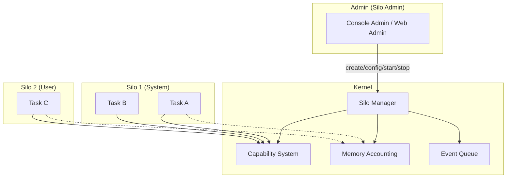
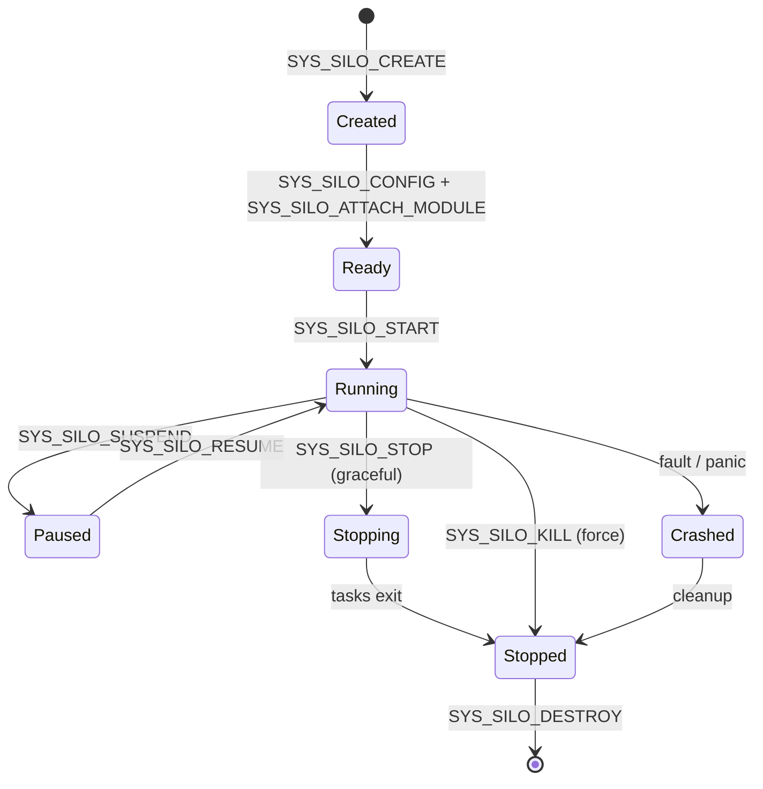

# Silo System

Silos are Strat9 OS's primary isolation mechanism. Each silo is a container for processes with bounded resources, restricted capabilities, and filesystem access control. Policy lives in userspace; the kernel enforces mechanisms.

---

## Overview



---

## Silo identity

Each silo has a numeric ID (`SiloId`) and a tier derived from the ID range:

| ID range | Tier | Purpose |
|----------|------|---------|
| 1–9 | `Critical` | Kernel system services (init, logger) |
| 10–999 | `System` | Drivers, filesystems, network |
| 1000+ | `User` | User applications |

User-tier silos cannot have hardware or control permissions (enforced at creation).

---

## Silo lifecycle



**States:** `Created → Loading → Ready → Running → Paused → Stopping → Stopped → Destroyed` (also `Crashed`, `Zombie`)

---

## Resource limits

The `SiloConfig` struct defines per-silo resource bounds:

```text
SiloConfig {
    mem_min: u64,           // Minimum guaranteed memory (bytes)
    mem_max: u64,           // Maximum allowed memory (0 = unlimited)
    cpu_shares: u32,        // CPU share weight (for proportional scheduling)
    cpu_quota_us: u64,      // CPU time quota per period (microseconds)
    cpu_period_us: u64,     // Quota period (microseconds)
    cpu_affinity_mask: u64, // CPU affinity bitmask
    max_tasks: u32,         // Maximum concurrent tasks
    io_bw_read: u64,        // Read bandwidth limit
    io_bw_write: u64,       // Write bandwidth limit
    flags: u64,             // Feature flags
    family: u8,             // Silo family (SYS/DRV/FS/NET/WASM/USR)
}
```

**Memory accounting:** Every allocation through the kernel heap charges against the silo's `mem_usage_bytes`. When `mem_max` is exceeded, `charge_current_task_memory()` returns `OutOfMemory`. This is enforced transparently in the buddy allocator and slab paths.

---

## Octal mode (pledge/unveil)

Access control uses an `OctalMode` with three permission groups, encoded as a 12-bit octal value:

| Bits | Group | Permissions |
|------|-------|------------|
| 8–10 | **Control** | `LIST` (0b100), `STOP` (0b010), `SPAWN` (0b001) |
| 5–7 | **Hardware** | `INTERRUPT` (0b100), `IO` (0b010), `DMA` (0b001) |
| 2–4 | **Registry** | `LOOKUP` (0b100), `BIND` (0b010), `PROXY` (0b001) |

Example: `0o755` = LIST+STOP+SPAWN + INTERRUPT+IO + LOOKUP+BIND

### Pledge

`SYS_SILO_PLEDGE(mode)` restricts the silo's permissions. The new mode must be a **subset** of the current mode : escalation is rejected with `PermissionDenied`.

```text
silo.mode.pledge(new_mode):
    if !new_mode.is_subset_of(self.mode):
        return PermissionDenied  // escalation attempt
    self.mode = new_mode
```

### Unveil

`SYS_SILO_UNVEIL(path, rights)` restricts filesystem access to specific paths with read/write/execute permissions. Multiple rules can be added; if a path matches no rule, access is denied.

**Rights bits:** `read (0x1)`, `write (0x2)`, `execute (0x4)`

**Matching:** A rule `/srv/data` matches `/srv/data/file.txt` but not `/srv/other`. Rule `/` matches everything.

### Enter Sandbox

`SYS_SILO_ENTER_SANDBOX()` is **irreversible** : it clears all registry permissions and prevents further capability grants. Once sandboxed, the silo cannot escape.

---

## Family types

| Family | Value | Purpose |
|--------|-------|---------|
| `SYS` | 0 | System services (init, admin) |
| `DRV` | 1 | Hardware drivers |
| `FS` | 2 | Filesystem handlers |
| `NET` | 3 | Network stack |
| `WASM` | 4 | WebAssembly runtime |
| `USR` | 5 | User applications |

---

## Feature flags

| Flag | Value | Description |
|------|-------|-------------|
| `SILO_FLAG_ADMIN` | `1 << 0` | Silo has admin capabilities |
| `SILO_FLAG_GRAPHICS` | `1 << 1` | Graphics session support |
| `SILO_FLAG_WEBRTC_NATIVE` | `1 << 2` | WebRTC native support (requires GRAPHICS) |
| `SILO_FLAG_GRAPHICS_READ_ONLY` | `1 << 3` | Graphics read-only mode |
| `SILO_FLAG_WEBRTC_TURN_FORCE` | `1 << 4` | Force TURN relay for WebRTC |

---

## Module system (CMOD)

Silos can load code modules in the `CMOD` binary format:

```text
Strat9ModuleHeader {
    magic: "CMOD",
    version: 1 or 2,
    cpu_arch: 0 (x86_64),
    flags: MODULE_FLAG_SIGNED | MODULE_FLAG_KERNEL,
    code_offset/size, data_offset/size, bss_size,
    entry_point,
    export/import/relocation tables,
    key_id, signature,
    cpu_features_required (v2+),
}
```

**Loading flow:**

1. Admin calls `SYS_MODULE_LOAD` with a blob (from file, IPC stream, or initfs path)
2. Kernel validates the header (magic, version, alignment, signature)
3. Module is registered in the global `ModuleRegistry`
4. Admin calls `SYS_SILO_ATTACH_MODULE` to bind the module to a silo
5. Admin calls `SYS_SILO_START` to launch the silo's entry point

---

## Events

The kernel pushes events to a fixed-capacity ring buffer (256 entries). Userspace polls via `SYS_SILO_EVENT_NEXT`.

| Event | Trigger |
|-------|---------|
| `Started` | Silo started or config updated |
| `Stopped` | Graceful stop |
| `Killed` | Force kill |
| `Crashed` | Fault/panic (data0 encodes fault reason + subcode) |
| `Paused` | Suspended |
| `Resumed` | Resumed from pause |

**Crash encoding:** `data0 = fault_reason | (subcode << 16)`

- `PageFault (1)`, `GeneralProtection (2)`, `InvalidOpcode (3)`

---

## Silo admin

Admin operations require a `ResourceType::Silo` capability with `grant` permission. The `SILO_ADMIN_RESOURCE` (resource 0) is the special admin handle.

**Bootstrap:** The init process receives a silo-admin capability at boot via `create_silo_admin_capability()`.

**Admin operations:**

| Operation | Function | Description |
|-----------|----------|-------------|
| Create | `kernel_spawn_strate()` | Register module, create silo, spawn task |
| Start | `kernel_start_silo()` | Transitions Ready → Running |
| Stop | `kernel_stop_silo()` | Graceful stop (tasks exit) |
| Kill | `kernel_stop_silo(force=true)` | Force kill all tasks |
| Destroy | `kernel_destroy_silo()` | Remove silo (must be stopped) |
| Rename | `kernel_rename_silo_label()` | Change silo label |
| Pledge | `sys_silo_pledge()` | Restrict permissions |
| Unveil | `sys_silo_unveil()` | Restrict filesystem access |
| Sandbox | `sys_silo_enter_sandbox()` | Lock down (irreversible) |

---

## Path-based label assignment

When a filesystem path matches `/srv/strate-fs-<type>/<label>/`, the label is automatically assigned to the silo. This allows convention-based service discovery.

---

## Silo vs. other isolation mechanisms

| Mechanism | Scope | Enforcement |
|-----------|-------|-------------|
| **Silo** | Process group + resources + capabilities | Kernel (SiloManager) |
| **Capability** | Individual resource access | Kernel (CapabilityManager) |
| **Pledge** | Syscall permission subset | Kernel (OctalMode) |
| **Unveil** | Filesystem path access | Kernel (UnveilRules) |
| **Sandbox** | Full lockdown (irreversible) | Kernel (sandboxed flag) |
