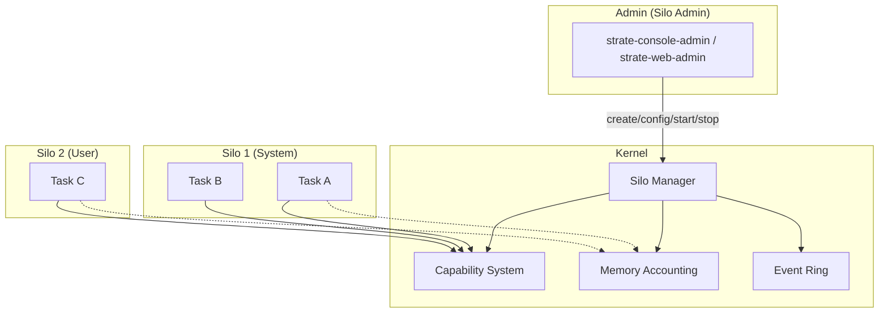
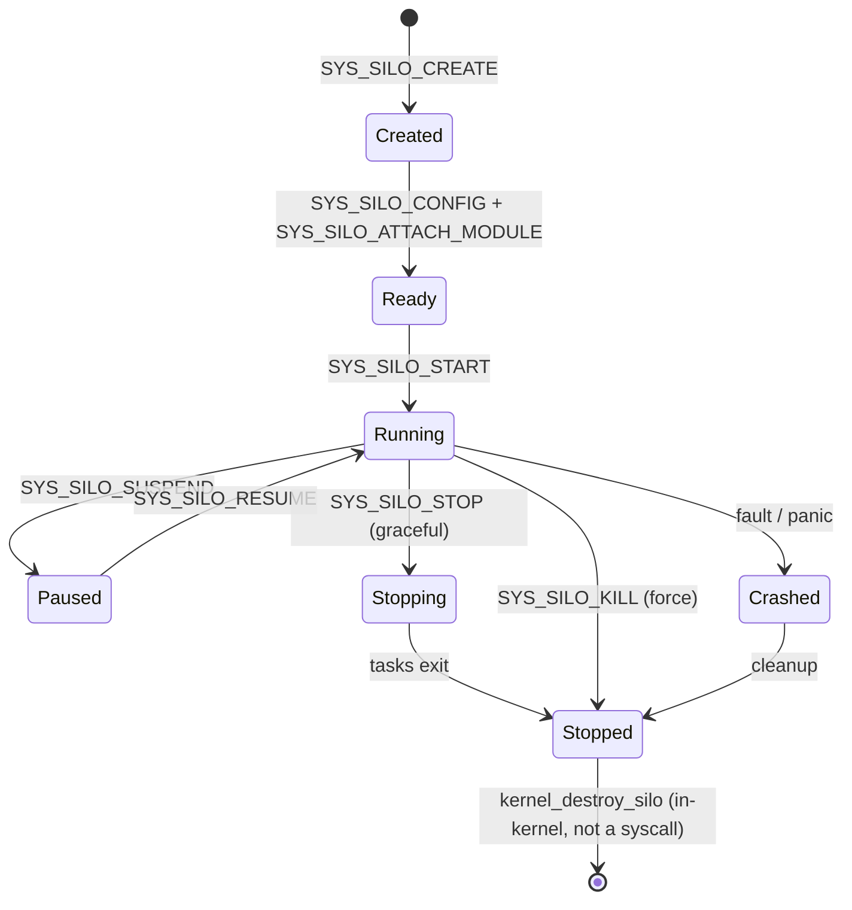

# Silo System

Silos are Strat9 OS's primary isolation mechanism. Each silo is a container for processes with bounded resources, restricted capabilities, and filesystem path control. Policy is expressed by the caller; the kernel enforces the mechanism.

The implementation lives in `workspace/kernel/src/silo/` (`mod.rs`, 3292 lines, plus `silo_test.rs` behind the `selftest` feature).

---

## Overview


```mermaid
graph TB
    subgraph "Admin (Silo Admin)"
        ADMIN[strate-console-admin / strate-web-admin]
    end

    subgraph "Kernel"
        SM[Silo Manager]
        CAP[Capability System]
        MEM[Memory Accounting]
        EV[Event Ring]
    end

    subgraph "Silo 1 (System)"
        T1[Task A]
        T2[Task B]
    end

    subgraph "Silo 2 (User)"
        T3[Task C]
    end

    ADMIN -->|create/config/start/stop| SM
    SM --> CAP
    SM --> MEM
    SM --> EV
    T1 --> CAP
    T2 --> CAP
    T3 --> CAP
    T1 -.-> MEM
    T3 -.-> MEM
```

---

## Silo identity

Each silo is a `SiloId { sid: u32, tier: SiloTier }`. The tier is **not stored or configured** — `SiloId::new()` recomputes it from the numeric id on every construction:

| ID range | Tier | Purpose |
|----------|------|---------|
| `1..=9` | `SiloTier::Critical` | Kernel system services (init, logger) |
| `10..=999` | `SiloTier::System` | Drivers, filesystems, network |
| everything else, **including `0`** | `SiloTier::User` | User applications |

`kernel_check_spawn_invariants` rejects a User-tier silo that requests hardware or control permission bits.

Ids are allocated from the lowest free value upward for boot strates (`register_boot_strate_task`) and from 1000 upward for `kernel_spawn_strate`.

---

## Silo lifecycle


```mermaid
stateDiagram-v2
    [*] --> Created : SYS_SILO_CREATE
    Created --> Ready : SYS_SILO_CONFIG + SYS_SILO_ATTACH_MODULE
    Ready --> Running : SYS_SILO_START
    Running --> Paused : SYS_SILO_SUSPEND
    Paused --> Running : SYS_SILO_RESUME
    Running --> Stopping : SYS_SILO_STOP (graceful)
    Stopping --> Stopped : tasks exit
    Running --> Stopped : SYS_SILO_KILL (force)
    Running --> Crashed : fault / panic
    Crashed --> Stopped : cleanup
    Stopped --> [*] : kernel_destroy_silo (in-kernel, not a syscall)
```

`SiloState` declares ten values: `Created (0)`, `Loading (1)`, `Ready (2)`, `Running (3)`, `Paused (4)`, `Stopping (5)`, `Stopped (6)`, `Crashed (7)`, `Zombie (8)`, `Destroyed (9)`.

> **In practice only `Crashed` is ever assigned** as a terminal state. `Zombie` and `Destroyed` are declared but never set — a destroyed silo is removed from the registry outright, so there is no observable `Destroyed` state.

**There is no `SYS_SILO_DESTROY` syscall.** The syscall block is 800–812 plus `SYS_ABI_VERSION` (900). Destruction is the in-kernel `kernel_destroy_silo()`, reachable through the admin silo.

---

## Resource limits

`SiloConfig` is passed by pointer to `SYS_SILO_CREATE`, and patched later by `SYS_SILO_CONFIG`:

```text
SiloConfig {                      // repr(C)
    mem_min: u64,                 // Minimum guaranteed memory (bytes)
    mem_max: u64,                 // Maximum allowed memory (0 = unlimited)
    cpu_shares: u32,              // CPU share weight
    cpu_quota_us: u64,            // CPU time quota per period (microseconds)
    cpu_period_us: u64,           // Quota period (microseconds)
    cpu_affinity_mask: u64,       // CPU affinity bitmask
    max_tasks: u32,               // Maximum concurrent tasks
    io_bw_read: u64,              // Read bandwidth limit
    io_bw_write: u64,             // Write bandwidth limit
    caps_ptr: u64,                // Pointer to an extra capability list
    caps_len: u64,
    flags: u64,                   // Feature flags (see below)
    sid: u32,
    mode: u16,                    // OctalMode, see below
    family: u8,                   // StrateFamily, see below
    cpu_features_required: u64,
    cpu_features_allowed: u64,
    xcr0_mask: u64,               // Computed from allowed features & host caps
    graphics_max_sessions: u16,   // 0 = graphics disabled
    graphics_session_ttl_sec: u32,
    graphics_reserved: u16,       // Reserved for ABI expansion
}
```

`sid` and `mode` are the two fields actually read back from the incoming struct.

### Memory accounting is best-effort, not transparent

`charge_task_silo_memory` is called from **`memory/address_space.rs`** — on address-space reserve and on `mmap` — and released on unmap, fork, exec and thread exit. It is **not** hooked into the buddy allocator or the slab.

Worse, the charge path uses `try_lock` on the silo manager and **silently skips charging when the lock is contended**. The limit is therefore an accounting approximation under contention, not hard enforcement at the allocator. When a charge is refused, the allocation fails with `ENOMEM`.

---

## Octal mode (pledge / unveil)

Access control uses an `OctalMode` of three `bitflags!` bitfields. On the wire it is a **9-bit** value (`strat9_abi::data::SiloMode(u16)`, documented as "9-bit octal silo permission mode"), not 12-bit:

| Bit positions | Group | Permissions |
|---------------|-------|-------------|
| `6–8` | **Control** (`ControlMode: u8`) | `LIST (0b100)`, `STOP (0b010)`, `SPAWN (0b001)` |
| `3–5` | **Hardware** (`HardwareMode: u8`) | `INTERRUPT (0b100)`, `IO (0b010)`, `DMA (0b001)` |
| `0–2` | **Registry** (`RegistryMode: u8`) | `LOOKUP (0b100)`, `BIND (0b010)`, `PROXY (0b001)` |

`OctalMode::from_octal` reads `(val >> 6) & 0o7`, `(val >> 3) & 0o7` and `val & 0o7` respectively. The layout is pinned by `workspace/abi/tests/data_types.rs` (`silo_mode_bit_layout_is_lsb_registry`).

**Worked example.** `0o755` is `111 101 101`:

- control `111` → `LIST | STOP | SPAWN`
- hardware `101` → `INTERRUPT | DMA` (the middle bit is `IO`)
- registry `101` → `LOOKUP | PROXY` (the middle bit is `BIND`)

### Pledge

`SYS_SILO_PLEDGE(mode_val: u64)` restricts the silo's permissions. The argument is the **octal value itself**, not a string or a pointer. The new mode must be a subset of the current one; escalation is rejected with `EACCES`:

```rust
// OctalMode::pledge — the only form of this that compiles as written
pub fn pledge(&mut self, new_mode: OctalMode) -> Result<(), SyscallError> {
    if !new_mode.is_subset_of(self) {
        return Err(SyscallError::PermissionDenied); // escalation attempt
    }
    *self = new_mode;
    Ok(())
}
```

The syscall wrapper also mirrors the value into `silo.config.mode` and pushes a `Started` event (reused as "Updated").

### Unveil

`SYS_SILO_UNVEIL(path_ptr, path_len, rights_bits)` restricts filesystem access. The third argument is an `UnveilRights` **bitmask**, not a `"rwx"` string: `read = 0x1`, `write = 0x2`, `execute = 0x4`; any other bit gives `EINVAL`.

```text
limits: path length <= 1024 bytes, at most 128 rules (ENOBUFS beyond that)
path must be absolute, non-empty and contain no NUL byte
```

**Matching.** A rule `/srv/data` matches `/srv/data/file.txt` but not `/srv/other`. A rule `/` matches everything.

**Three behaviours that are easy to get wrong:**

1. **A silo with no unveil rules has *unrestricted* path access.** `enforce_path_for_current_task` returns `Ok(())` immediately when the rule list is empty. The default-deny only applies once at least one rule exists.
2. **Re-declaring an existing path narrows, never widens.** A second unveil for the same path *intersects* the rights with what is already there.
3. **Sandboxed silos still go through the same path check**, so an empty rule list stays permissive.

### Enter Sandbox

`SYS_SILO_ENTER_SANDBOX()` takes no arguments and is **irreversible**: it clears the registry permission bits and sets a sandbox flag that `enforce_silo_may_grant` consults to block further capability grants.

---

## Family types

`StrateFamily` is a plain `u8` enum, decoded from a numeric field with `decode_family`:

| Family | Value | Purpose |
|--------|-------|---------|
| `SYS` | 0 | System services (init, admin) |
| `DRV` | 1 | Hardware drivers |
| `FS` | 2 | Filesystem handlers |
| `NET` | 3 | Network stack |
| `WASM` | 4 | WebAssembly runtime |
| `USR` | 5 | User applications |

> The family is carried in the config and the IPC message label, but the kernel does **not** enforce a family-based IPC policy. There is no per-family allow-list and no "a USER silo may not talk to a DRV silo" check.

---

## Feature flags

| Flag | Value | Description |
|------|-------|-------------|
| `SILO_FLAG_ADMIN` | `1 << 0` | Silo has admin capabilities |
| `SILO_FLAG_GRAPHICS` | `1 << 1` | Graphics session support |
| `SILO_FLAG_WEBRTC_NATIVE` | `1 << 2` | WebRTC native support (requires graphics) |
| `SILO_FLAG_GRAPHICS_READ_ONLY` | `1 << 3` | Graphics read-only mode |
| `SILO_FLAG_WEBRTC_TURN_FORCE` | `1 << 4` | Force TURN relay for WebRTC |

---

## Silo syscalls

| # | Syscall | Kernel args | Notes |
|---|---------|-------------|-------|
| 800 | `SYS_SILO_CREATE` | `config_ptr: u64` | Takes a `SiloConfig` pointer; the doc's "no arguments" is wrong |
| 801 | `SYS_SILO_CONFIG` | `handle, res_ptr` | Two arguments, not the five `(silo_id, key, …)` the ABI header claims |
| 802 | `SYS_SILO_ATTACH_MODULE` | `handle, module_handle` | |
| 803 | `SYS_SILO_START` | `handle` | |
| 804 | `SYS_SILO_STOP` | `handle` | Graceful |
| 805 | `SYS_SILO_KILL` | `handle` | Force |
| 806 | `SYS_SILO_EVENT_NEXT` | `event_ptr` | **No silo id** — the silo is derived from the caller |
| 807 | `SYS_SILO_SUSPEND` | `handle` | |
| 808 | `SYS_SILO_RESUME` | `handle` | |
| 809 | `SYS_SILO_PLEDGE` | `mode_val: u64` | The octal value directly |
| 810 | `SYS_SILO_UNVEIL` | `path_ptr, path_len, rights_bits` | Bitmask, not a string |
| 811 | `SYS_SILO_ENTER_SANDBOX` | : | Irreversible |
| 812 | `SYS_SILO_RENAME` | `handle, label_ptr, label_len` | |

---

## Module system (CMOD)

Silos can load code modules in the `CMOD` binary format. `Strat9ModuleHeader`:

```text
magic: "CMOD"
version: 1 or 2
cpu_arch: 0 (x86_64)
flags: MODULE_FLAG_SIGNED | MODULE_FLAG_KERNEL
code_offset / code_size / data_offset / data_size / bss_size
entry_point
export / import / relocation tables
key_id / signature
cpu_features_required   (v2 and later)
```

`parse_module_header` validates magic, version, alignment and the signature, and rejects anything it does not recognise.

**Loading flow:**

1. Admin calls `SYS_MODULE_LOAD(fd_or_ptr, len)` with a blob from a file, an IPC stream or initfs
2. Kernel validates the header and registers the module in the global `ModuleRegistry`
3. Admin calls `SYS_SILO_ATTACH_MODULE` to bind the module to a silo
4. Admin calls `SYS_SILO_START` to launch the silo's entry point

---

## Events

The kernel pushes events to a fixed-capacity ring of **256** entries (`SILO_EVENTS_CAPACITY`). Userspace reads them with `SYS_SILO_EVENT_NEXT`, which writes a `SiloEvent` to the pointer it is given.

| Event | Trigger |
|-------|---------|
| `Started` | Silo started — or config updated (the kind is reused for both) |
| `Stopped` | Graceful stop |
| `Killed` | Force kill |
| `Crashed` | Fault or panic |
| `Paused` | Suspended |
| `Resumed` | Resumed from pause |

**Crash encoding:** `data0 = fault_reason | (subcode << 16)` with `FAULT_SUBCODE_SHIFT = 16`:

- `PageFault (1)`, `GeneralProtection (2)`, `InvalidOpcode (3)`

---

## Silo admin

Admin operations require a `ResourceType::Silo` capability carrying the `grant` permission. `SILO_ADMIN_RESOURCE = 0` is the special admin handle. The init process receives one at boot through `create_silo_admin_capability()` / `grant_silo_admin_to_task`.

**Every admin function takes a `&str` selector — either the numeric SID or the label — and returns `Result<u32, SyscallError>` where the `u32` is the resolved silo id.** The signatures in older revisions of this page took an `OctalMode` directly and returned nothing; that is not what the code does.

| Operation | Function | Description |
|-----------|----------|-------------|
| Create | `kernel_spawn_strate(selector, …)` | Register module, create silo, spawn task; auto-assigns ids from 1000 |
| Start | `kernel_start_silo(selector)` | Transitions Ready → Running |
| Stop | `kernel_stop_silo(selector)` | Graceful stop |
| Kill | `kernel_stop_silo(selector)` on a killed silo | Force stop |
| Destroy | `kernel_destroy_silo(selector)` | Removes the silo from the registry; must be stopped first |
| Rename | `kernel_rename_silo_label(selector, label)` | Change the display label |
| Pledge | `sys_silo_pledge(mode_val: u64)` | Restrict permissions |
| Unveil | `sys_silo_unveil(path_ptr, path_len, rights_bits)` | Restrict filesystem access |
| Sandbox | `sys_silo_enter_sandbox()` | Irreversible lockdown |

---

## Path-based label assignment

When a filesystem path matches `/srv/strate-fs-<type>/<label>/`, `extract_strate_label` derives the label and assigns it to the silo. This provides convention-based service discovery for filesystem-hosted strates.

---

## Silo vs. other isolation mechanisms

| Mechanism | Scope | Enforcement | State |
|-----------|-------|-------------|-------|
| **Silo** | Process group + resources + capabilities | Kernel `SiloManager` | Implemented |
| **Capability** | Individual resource access | Kernel `capability.rs` (`CapId`, `CapPermissions`) | Implemented |
| **Pledge** | Octal-mode permission subset | Kernel `OctalMode::pledge` | Implemented |
| **Unveil** | Filesystem path access | Kernel `UnveilRule` list | Implemented, with the empty-list caveat above |
| **Sandbox** | Full lockdown, irreversible | Kernel sandbox flag | Implemented |
| **Family policy** | Per-family IPC restrictions | — | **Not implemented** — the family is carried but never enforced |
| **Memory quota** | Per-silo `mem_max` | `memory/address_space.rs` | Implemented, best-effort under lock contention |
| **Capability type ceiling** | Restrict which capability types a silo may hold | — | **Not implemented** |

## See also

- [Syscall Reference → Silo management](./syscalls.md#silo-management)
- [IPC Mechanisms](./ipc-mechanisms.md) — silo tiers drive the transport matrix
- `doc/silo_security_model.md` — the design spec; several of its mechanisms (IPC coloration, capability derivation, family profiles, the audit ring) are **not implemented**. Read it as a proposal, not a description.
